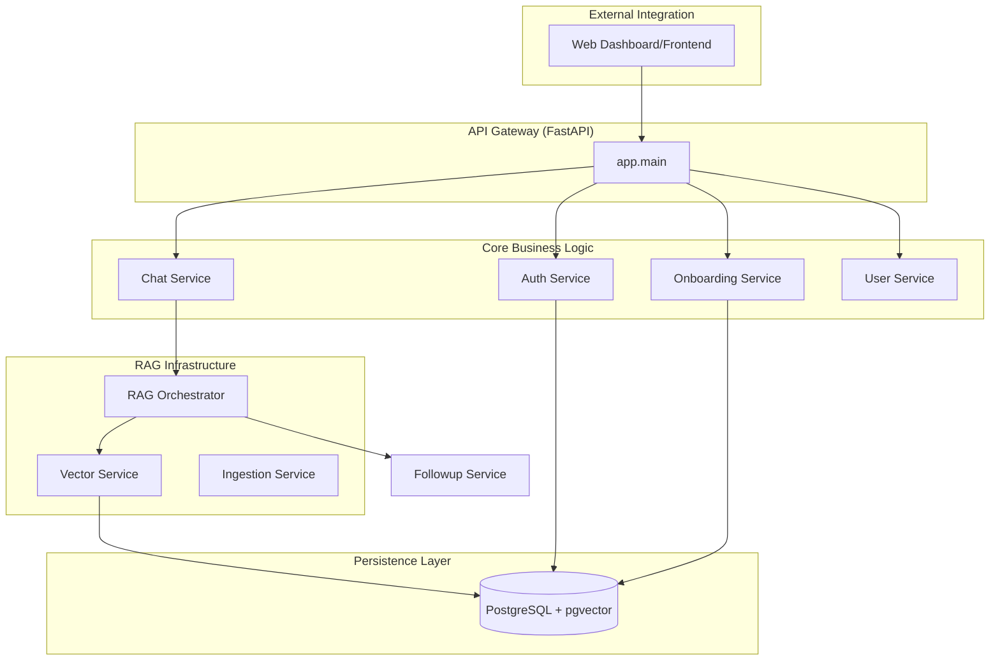
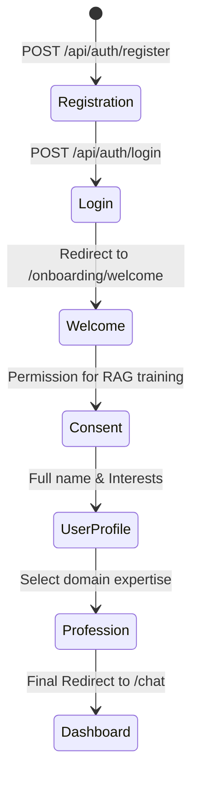

# LLM User Service

**Enterprise-Grade RAG System with Modular Monolith Architecture**

*A sophisticated Retrieval-Augmented Generation (RAG) platform built for high-accuracy domain-specific search and chat.*

---

## 📋 Table of Contents

- [Overview](#overview)
- [Key Features](#key-features)
- [System Architecture](#system-architecture)
- [The RAG Pipeline](#the-rag-pipeline)
- [User Lifecycle & Onboarding](#user-lifecycle--onboarding)
- [Quick Start Guide](#quick-start-guide)
- [Core Service Breakdown](#core-service-breakdown)
- [API Reference](#api-reference)
- [Configuration (.env)](#configuration-env)
- [Monitoring & Diagnostics](#monitoring--diagnostics)

---

## 🎯 Overview

The **LLM User Service** is a production-ready **Modular Monolith** designed to bridge the gap between messy unstructured data and high-quality LLM responses. Unlike simple wrappers, this system treats retrieval as a first-class citizen, implementing a multi-stage pipeline that combines **Vector Similarity (Dense)** and **Keyword Matching (Sparse)** with advanced query expansion and reranking.

---

## ✨ Key Features

### 🔍 Advanced Retrieval (Hybrid 2.0)
- **Dense Search**: Leveraging `pgvector` for semantic similarity embeddings.
- **Sparse Search**: Native BM25 implementation for precise terminology matching.
- **Hybrid Fusion**: Reciprocal Rank Fusion (RRF) to combine search strategies for optimal precision.
- **Multi-Source Support**: Seamlessly query across multiple document sets and knowledge bases.

### 🧠 Intelligence Layer
- **Query Expansion**: Strategies include Static, LLM-driven, and Hybrid methods to catch semantic nuances.
- **Smart Reranking**: Cross-Encoder and LLM-based reranking to ensure only the most relevant context reaches the prompt.
- **Mistral AI Integration**: Optimized for the **Ministral 8B** family:
  - **Primary Model**: `ministral-8b-2512` (for high-speed, high-accuracy RAG).
  - **Query Rewriting**: `mistralai/ministral-8b-2512` (for conversational history expansion).
- **Multi-LLM Agnostic**: Support for OpenAI, Gemini, and OpenRouter for maximum model flexibility.

### 🛡️ Enterprise Security & Trust
- **Consent Gate**: Privacy-first approach ensuring user data usage is explicitly authorized.
- **JWT Authentication**: Secure, stateless token management with access cookies.
- **Modular Design**: Completely decoupled services (`Auth`, `User`, `Chat`, `Vector`) within a single deployable unit.

---

## 🏗️ System Architecture

The project follows a **Modular Monolith** pattern, where logically independent services share a common database but maintain strict boundary separation.

---

## 🚀 The RAG Pipeline

Every query processed by the **Chat Service** goes through an intensive 5-stage lifecycle:

1.  **Intent & Expansion**: The raw query is expanded into multiple variations to cover synonyms and related concepts.
2.  **Hybrid Retrieval**: Simultaneously queries the Vector DB (Semantic) and BM25 Index (Keywords).
3.  **Context Merging**: Uses RRF to unify results into a single ranked list.
4.  **Reranking**: A secondary model validates context relevance against the original query to filter noise.
5.  **Generation**: The final "Gold Context" is sent to the LLM with instructions to synthesize a grounded response.

---

## 👤 User Lifecycle & Onboarding

The system implements a structured user journey to ensure data completeness and compliance:

---

## ⚡ Quick Start Guide

### Prerequisites
- **Python 3.10+**
- **PostgreSQL 15+** with the `pgvector` extension installed.
- **API Keys**: Mistral (default) or OpenAI/OpenRouter.

### Installation
[Standard Python setup steps here...]

---

## 🗄️ Database Connection Management

To ensure stability on cloud databases (like AWS RDS), the system implements several connection optimization strategies:

### ⚙️ Pool Configuration
- **Conservative Pooling**: Default `DB_POOL_SIZE` is set to `2` with a `DB_MAX_OVERFLOW` of `4`. This prevents connection exhaustion on smaller instances (e.g., `db.t3.micro`).
- **Connection Intervals**: `pool_recycle` is set to 1800 seconds to automatically flush stale connections.
- **Resilience**: `pool_pre_ping` is enabled to verify connection health before use, preventing `closed connection` errors.

### 🏥 Health Check Optimization
- **Smart Caching**: The `/health` endpoint caches database status for 10 seconds. This prevents high-frequency UI refreshes from hammering the database with new connection requests.
- **Fail-Fast**: Implementation of `connect_timeout=10` ensures that the application doesn't hang indefinitely if the database is unreachable.

---

**Maintained By**: Development Team
