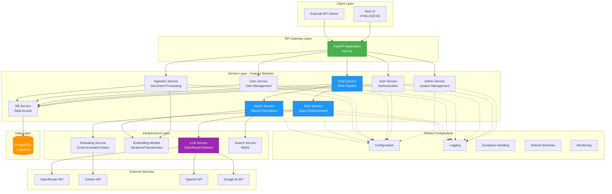
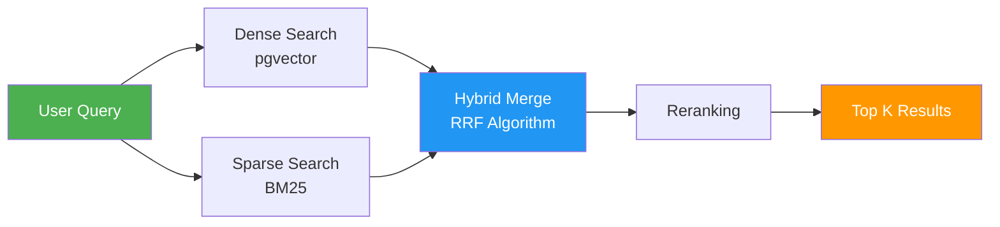
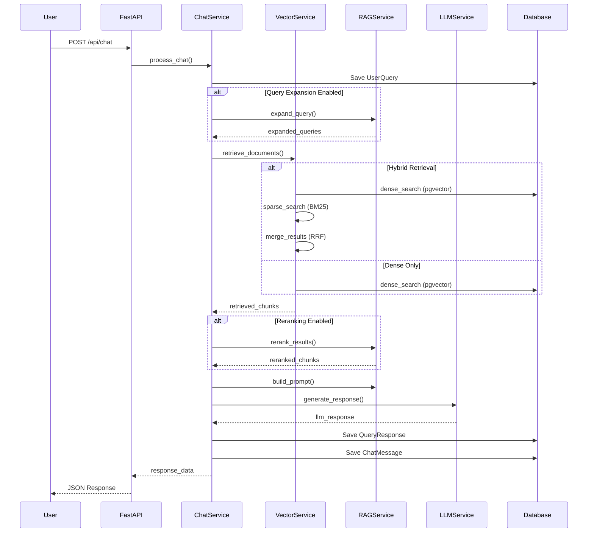
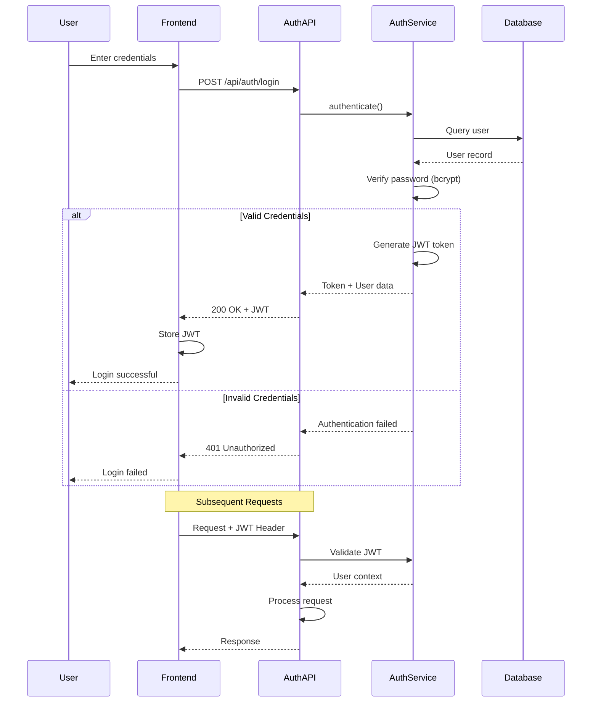
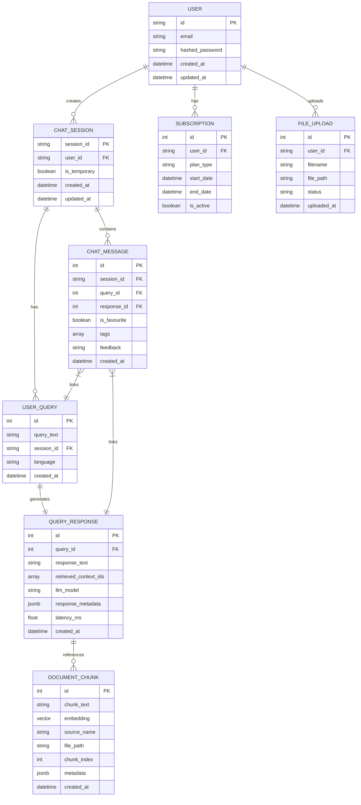
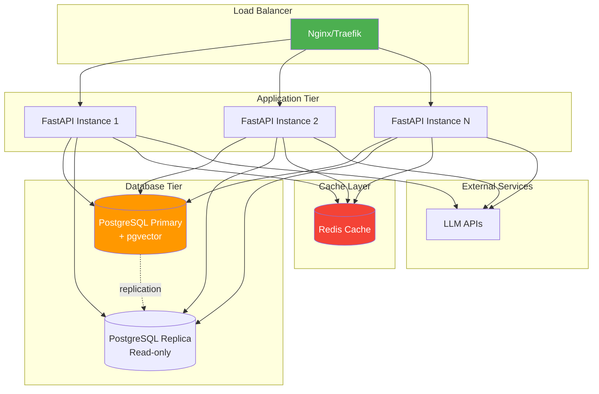

# Architecture Overview

## Table of Contents
- [System Overview](#system-overview)
- [Architecture Pattern](#architecture-pattern)
- [System Architecture Diagram](#system-architecture-diagram)
- [Service Components](#service-components)
- [Data Flow](#data-flow)
- [RAG Pipeline](#rag-pipeline)
- [Authentication Flow](#authentication-flow)
- [Database Schema](#database-schema)
- [Technology Stack](#technology-stack)

---

## System Overview

The **LLM User Service** is a production-grade **Retrieval-Augmented Generation (RAG)** system built as a **Modular Monolith**. It provides intelligent question-answering capabilities by combining vector search, hybrid retrieval, and large language models.

### Key Capabilities
- **Semantic Search** - Vector-based similarity search using pgvector
- **Hybrid Retrieval** - Combines dense (vector) and sparse (BM25) search
- **Query Expansion** - Enhances queries for better retrieval
- **Reranking** - Improves result relevance using cross-encoders
- **Multi-LLM Support** - OpenRouter, OpenAI, Google Generative AI
- **Session Management** - Persistent chat sessions with history
- **Document Ingestion** - Automated document processing and embedding

---

## Architecture Pattern

### Modular Monolith

The system follows a **Modular Monolith** architecture pattern, organizing code into feature-based service modules with clear boundaries and responsibilities.

#### Benefits
- **Independent Development** - Teams can work on different services independently
- **Clear Boundaries** - Well-defined interfaces between modules
- **Easier Testing** - Services can be tested in isolation
- **Deployment Simplicity** - Single deployment unit (vs microservices)
- **Shared Resources** - Efficient use of database connections and models

#### Domain-Driven Design (DDD) Layers

Each service follows a **layered architecture** inspired by DDD:

```
┌─────────────────────────────────────┐
│         API Layer (Routes)          │  ← FastAPI endpoints
├─────────────────────────────────────┤
│    Application Layer (Services)     │  ← Business logic orchestration
├─────────────────────────────────────┤
│      Domain Layer (Entities)        │  ← Core business models
├─────────────────────────────────────┤
│  Infrastructure Layer (Adapters)    │  ← External integrations
└─────────────────────────────────────┘
```

---

## System Architecture Diagram



---

## Service Components

### 1. Admin Service
**Purpose**: System administration and monitoring

**Responsibilities**:
- Health checks and diagnostics
- System metrics and monitoring
- Session management
- Resource information
- Response logging

**Key Endpoints**:
- `GET /api/health` - System health status
- `GET /api/diagnostics` - Detailed diagnostics
- `GET /api/monitoring/metrics` - Performance metrics
- `GET /api/sessions` - Session management

---

### 2. Auth Service
**Purpose**: Authentication and authorization

**Responsibilities**:
- User authentication (JWT)
- User registration
- Token management
- Password hashing (bcrypt)

**Key Endpoints**:
- `POST /api/auth/login` - User login
- `POST /api/auth/register` - User registration

**Architecture**:
```
auth_service/
├── api/          # FastAPI routes
├── application/  # Auth business logic
├── domain/       # User entities
└── infrastructure/ # JWT, password hashing
```

---

### 3. Chat Service
**Purpose**: Conversational interface and RAG pipeline orchestration

**Responsibilities**:
- Process user queries
- Orchestrate RAG pipeline
- Manage chat sessions
- Return formatted responses

**Key Endpoints**:
- `POST /api/chat` - Chat endpoint (simplified)
- `POST /api/query` - Full RAG pipeline

**Architecture**:
```
chat_service/
├── api/          # Chat routes
├── application/  # ChatService (orchestrator)
├── domain/       # Chat entities
└── infrastructure/ # External integrations
```

---

### 4. DB Service
**Purpose**: Database access and ORM models

**Responsibilities**:
- SQLAlchemy models
- Database connection management
- CRUD operations
- Database migrations

**Key Components**:
- `models.py` - SQLAlchemy ORM models
- `database.py` - Connection setup
- `crud.py` - CRUD operations
- `migrations/` - Database migrations

**Models**:
- `UserQuery` - User questions
- `QueryResponse` - LLM responses
- `DocumentChunk` - Vector embeddings
- `ChatSession` - Chat sessions
- `ChatMessage` - Chat messages
- `Subscription` - User subscriptions
- `FileUpload` - Uploaded files

---

### 5. Ingestion Service
**Purpose**: Document processing and embedding generation

**Responsibilities**:
- Document upload handling
- Text extraction and cleaning
- Chunk generation
- Embedding creation
- Vector storage

**Key Endpoints**:
- `POST /api/ingest` - Upload and process documents
- `GET /api/documents` - List documents
- `DELETE /api/documents/{id}` - Delete document

**Architecture**:
```
ingestion_service/
├── api/          # Ingestion routes
├── application/  # Document processing
│   ├── cleaning/ # Text cleaning
│   └── folder_service.py
├── domain/       # Document entities
└── infrastructure/ # File storage
```

---

### 6. RAG Service
**Purpose**: Query enhancement and LLM orchestration

**Responsibilities**:
- Query expansion (multiple strategies)
- LLM integration (OpenRouter, OpenAI, Google)
- Prompt template management
- Response reranking
- Multi-language support

**Key Components**:
- `query_expansion_service.py` - Query enhancement
- `llm_service.py` - LLM orchestration
- `reranking_service.py` - Result reranking
- `prompt_templates.py` - Prompt management
- `multilang_service.py` - Language detection

**Query Expansion Strategies**:
- **Static** - Predefined expansions
- **LLM** - LLM-generated expansions
- **Hybrid** - Combines multiple strategies
- **Module-wise** - Domain-specific expansions
- **Token-optimized** - Efficient token usage

**Reranking Types**:
- **Cross-Encoder** - Transformer-based reranking
- **Cohere** - Cohere Rerank API
- **BGE** - BGE reranker model
- **LLM** - LLM-based reranking

---

### 7. User Service
**Purpose**: User profile and preference management

**Responsibilities**:
- User profile CRUD
- User preferences
- User settings

**Key Endpoints**:
- `GET /api/user/profile` - Get user profile
- `PUT /api/user/profile` - Update profile
- `GET /api/user/preferences` - Get preferences

---

### 8. Vector Service
**Purpose**: Vector search and hybrid retrieval

**Responsibilities**:
- Dense vector search (pgvector)
- Sparse search (BM25)
- Hybrid retrieval (combines both)
- Search service initialization

**Key Components**:
- `search_service.py` - BM25 search
- `hybrid_retrieval.py` - Hybrid search

**Search Methods**:


---

## Data Flow

### High-Level Request Flow



---

## RAG Pipeline

### Detailed RAG Pipeline Flow

```mermaid
flowchart TD
    START([User Query]) --> VALIDATE{Valid Query?}
    VALIDATE -->|No| ERROR[Return Error]
    VALIDATE -->|Yes| SESSION[Create/Get Session]
    
    SESSION --> SAVE_QUERY[Save to user_queries]
    SAVE_QUERY --> EXPAND{Query Expansion<br/>Enabled?}
    
    EXPAND -->|Yes| EXPANSION[Query Expansion Service]
    EXPANSION --> STRATEGY{Strategy}
    STRATEGY -->|Static| STATIC[Predefined Terms]
    STRATEGY -->|LLM| LLM_EXPAND[LLM Generation]
    STRATEGY -->|Hybrid| HYBRID_EXPAND[Multiple Strategies]
    STATIC --> EXPANDED[Expanded Queries]
    LLM_EXPAND --> EXPANDED
    HYBRID_EXPAND --> EXPANDED
    
    EXPAND -->|No| ORIGINAL[Original Query]
    EXPANDED --> EMBED
    ORIGINAL --> EMBED
    
    EMBED[Generate Embeddings] --> RETRIEVAL{Retrieval Mode}
    
    RETRIEVAL -->|Dense| DENSE[pgvector Search]
    RETRIEVAL -->|Hybrid| HYBRID_RET[Hybrid Retrieval]
    
    HYBRID_RET --> DENSE_H[Dense Search]
    HYBRID_RET --> SPARSE[BM25 Search]
    DENSE_H --> RRF[Reciprocal Rank Fusion]
    SPARSE --> RRF
    RRF --> CHUNKS
    
    DENSE --> CHUNKS[Retrieved Chunks]
    
    CHUNKS --> RERANK{Reranking<br/>Enabled?}
    RERANK -->|Yes| RERANK_SVC[Reranking Service]
    RERANK_SVC --> RERANK_TYPE{Type}
    RERANK_TYPE -->|Cross-Encoder| CE[Cross-Encoder Model]
    RERANK_TYPE -->|Cohere| COHERE[Cohere API]
    RERANK_TYPE -->|BGE| BGE[BGE Model]
    RERANK_TYPE -->|LLM| LLM_RERANK[LLM Reranking]
    
    CE --> RANKED
    COHERE --> RANKED
    BGE --> RANKED
    LLM_RERANK --> RANKED
    
    RERANK -->|No| RANKED[Ranked Chunks]
    
    RANKED --> CONTEXT[Build Context]
    CONTEXT --> PROMPT[Build Prompt]
    PROMPT --> LLM[LLM Generation]
    
    LLM --> OPENROUTER{LLM Provider}
    OPENROUTER -->|OpenRouter| OR[OpenRouter API]
    OPENROUTER -->|OpenAI| OAI[OpenAI API]
    OPENROUTER -->|Google| GOOGLE[Google AI API]
    
    OR --> RESPONSE
    OAI --> RESPONSE
    GOOGLE --> RESPONSE
    
    RESPONSE[LLM Response] --> SAVE_RESP[Save to query_responses]
    SAVE_RESP --> SAVE_MSG[Save to chat_messages]
    SAVE_MSG --> RETURN([Return Response])
    
    style START fill:#4CAF50,color:#fff
    style EXPANSION fill:#2196F3,color:#fff
    style HYBRID_RET fill:#2196F3,color:#fff
    style RERANK_SVC fill:#9C27B0,color:#fff
    style LLM fill:#FF9800,color:#fff
    style RETURN fill:#4CAF50,color:#fff
```



### Pipeline Stages

#### 1. Query Processing
- Validate input
- Create/retrieve session
- Save query to database

#### 2. Query Enhancement (Optional)
- **Query Expansion** - Generate additional query variations
- **Language Detection** - Identify query language
- **Tagging** - Extract key terms

#### 3. Retrieval
- **Embedding Generation** - Convert query to vector
- **Dense Search** - Semantic similarity (pgvector)
- **Sparse Search** - Keyword matching (BM25)
- **Hybrid Merge** - Combine results using RRF

#### 4. Reranking (Optional)
- **Cross-Encoder** - Deep semantic matching
- **Cohere Rerank** - API-based reranking
- **BGE Reranker** - Efficient reranking
- **LLM Reranking** - LLM-based relevance

#### 5. Response Generation
- **Context Building** - Format retrieved chunks
- **Prompt Construction** - Build LLM prompt
- **LLM Call** - Generate response
- **Post-processing** - Format and validate

#### 6. Persistence
- Save response to database
- Link to chat session
- Update session metadata

---

## Authentication Flow



### JWT Token Structure
```json
{
  "sub": "user_id",
  "exp": 1234567890,
  "iat": 1234567890,
  "type": "access"
}
```

---

## Database Schema

### Entity Relationship Diagram



### Key Tables

#### user_queries
Stores all user questions
- `id` - Primary key
- `query_text` - The question
- `session_id` - Links to chat session
- `language` - Detected language
- `created_at` - Timestamp

#### query_responses
Stores LLM responses
- `id` - Primary key
- `query_id` - Links to user query
- `response_text` - LLM answer
- `retrieved_context_ids` - Array of chunk IDs
- `llm_model` - Model used
- `response_metadata` - Token counts, etc.
- `latency_ms` - Response time

#### document_chunks
Stores embedded document chunks
- `id` - Primary key
- `chunk_text` - Text content
- `embedding` - Vector (384-dim)
- `source_name` - Document name
- `file_path` - File location
- `chunk_index` - Position in document
- `metadata` - Additional info

#### chat_sessions
Manages chat sessions
- `session_id` - Primary key (UUID)
- `user_id` - User identifier
- `is_temporary` - Temporary session flag
- `created_at` - Creation time
- `updated_at` - Last activity

#### chat_messages
Links queries and responses to sessions
- `id` - Primary key
- `session_id` - Session reference
- `query_id` - Query reference
- `response_id` - Response reference
- `is_favourite` - User marked favorite
- `tags` - User tags
- `feedback` - User feedback

---

## Technology Stack

For detailed technology stack information, see [Tech Stack Documentation](tech_stack.md).

### Core Technologies
- **FastAPI** - Web framework
- **PostgreSQL + pgvector** - Database + vector search
- **SQLAlchemy** - ORM
- **Sentence Transformers** - Embeddings
- **PyTorch** - ML framework
- **OpenRouter** - LLM gateway

---

## Deployment Architecture

### Production Deployment



### Scaling Considerations

#### Horizontal Scaling
- **Stateless Application** - Multiple FastAPI instances
- **Load Balancing** - Distribute requests
- **Database Replication** - Read replicas for queries

#### Vertical Scaling
- **Database Resources** - Increase PostgreSQL resources
- **Model Caching** - Cache embeddings and models
- **Connection Pooling** - Efficient database connections

#### Caching Strategy
- **Response Cache** - Cache frequent queries
- **Embedding Cache** - Cache generated embeddings
- **Model Cache** - Cache loaded models in memory

---

## Security Considerations

### Authentication & Authorization
- **JWT Tokens** - Secure token-based auth
- **Password Hashing** - bcrypt with salt
- **Token Expiration** - 8-day default expiration

### Data Security
- **SQL Injection Protection** - SQLAlchemy ORM
- **Input Validation** - Pydantic schemas
- **CORS Configuration** - Configurable origins

### API Security
- **Rate Limiting** - Prevent abuse (recommended)
- **HTTPS/TLS** - Encrypted communication
- **API Key Management** - Secure key storage

---

## Monitoring & Observability

### Health Checks
- `GET /health` - System health status
- `GET /api/diagnostics` - Detailed diagnostics

### Metrics
- Request count and latency
- Token usage (LLM)
- Cache hit rates
- Database query performance

### Logging
- Structured logging (JSON)
- Log levels (DEBUG, INFO, WARNING, ERROR)
- Request/response logging
- Error tracking

---

## Performance Optimization

### Database Optimization
- **Indexes** - On frequently queried columns
- **Connection Pooling** - Reuse connections
- **Query Optimization** - Efficient SQL queries

### Vector Search Optimization
- **HNSW Indexes** - Fast approximate search
- **Batch Processing** - Process multiple queries
- **Dimension Reduction** - Smaller embeddings

### LLM Optimization
- **Prompt Caching** - Cache common prompts
- **Token Optimization** - Minimize token usage
- **Retry Logic** - Handle API failures gracefully

---

## Future Enhancements

### Planned Features
- [ ] Multi-tenancy support
- [ ] Advanced analytics dashboard
- [ ] Custom model fine-tuning
- [ ] Real-time collaboration
- [ ] Advanced caching strategies
- [ ] GraphQL API support
- [ ] Webhook integrations
- [ ] Advanced role-based access control

### Scalability Roadmap
- [ ] Microservices migration path
- [ ] Event-driven architecture
- [ ] Message queue integration (RabbitMQ/Kafka)
- [ ] Distributed tracing (OpenTelemetry)
- [ ] Service mesh (Istio)

---

## References

- [Tech Stack Documentation](tech_stack.md)
- [API Documentation](api_documentation.md)
- [Deployment Guide](deployment_guide.md)
- Service READMEs:
  - [Admin Service](../src/admin_service/README.md)
  - [Auth Service](../src/auth_service/README.md)
  - [Chat Service](../src/chat_service/README.md)
  - [DB Service](../src/db_service/README.md)
  - [Ingestion Service](../src/ingestion_service/README.md)
  - [RAG Service](../src/rag_service/README.md)
  - [User Service](../src/user_service/README.md)
  - [Vector Service](../src/vector_service/README.md)

---

**Document Version**: 1.0  
**Last Updated**: February 2026  
**Maintained By**: Development Team
