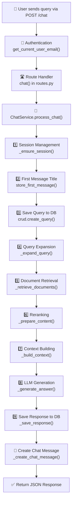
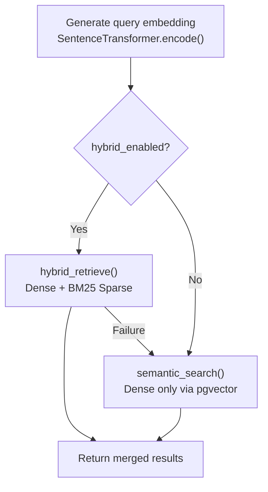
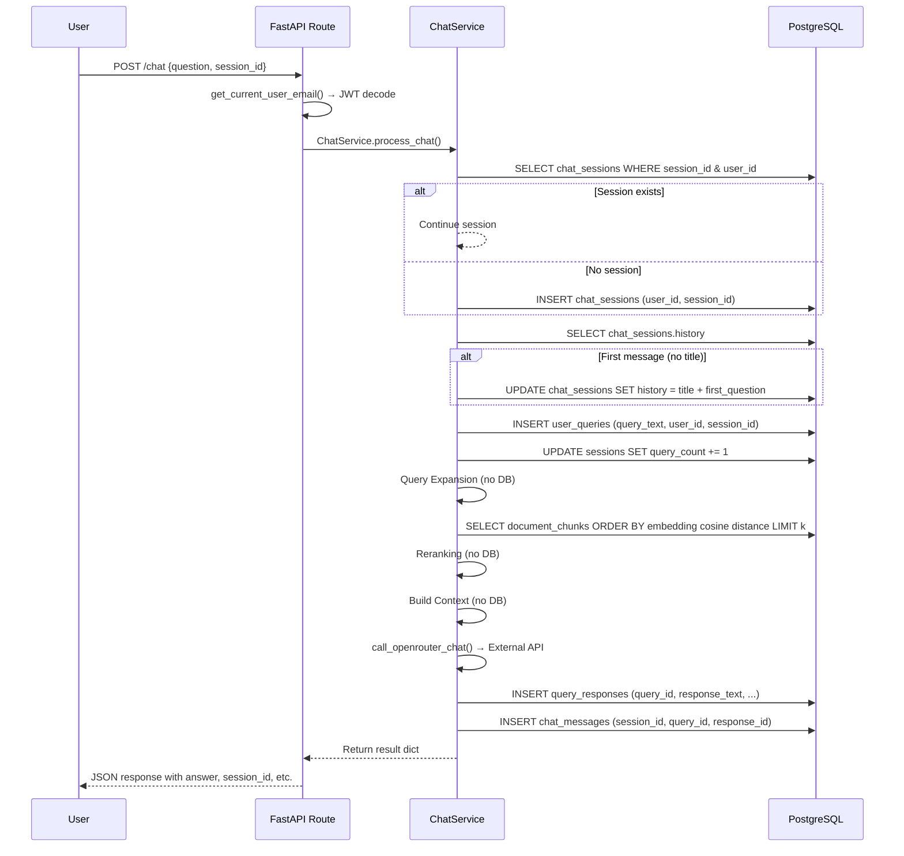

# LLM User Service — Complete Query Workflow Documentation

> **Last Updated:** 2026-03-02  
> This document traces the **entire execution flow** when a user submits a query — from HTTP request to final response — listing every function, service, and database interaction involved.

---

## Table of Contents

1. [High-Level Architecture](#high-level-architecture)
2. [Step-by-Step Execution Flow](#step-by-step-execution-flow)
   - [Step 0 — HTTP Request Arrives](#step-0--http-request-arrives)
   - [Step 1 — Authentication](#step-1--authentication-get_current_user_email)
   - [Step 2 — Route Handler](#step-2--route-handler-chat)
   - [Step 3 — RAG Pipeline Orchestrator](#step-3--rag-pipeline-orchestrator-chatserviceprocess_chat)
     - [3.1 — Session Management](#step-31--session-management-_ensure_session)
     - [3.2 — First Message Title](#step-32--first-message-title-generation-store_first_message)
     - [3.3 — Save Initial Query](#step-33--save-initial-query-crudcreate_query)
     - [3.4 — Query Expansion](#step-34--query-expansion-_expand_query)
     - [3.5 — Document Retrieval](#step-35--document-retrieval-_retrieve_documents)
     - [3.6 — Reranking](#step-36--reranking-_prepare_content)
     - [3.7 — Context Building](#step-37--context-building-_build_context)
     - [3.8 — LLM Answer Generation](#step-38--llm-answer-generation-_generate_answer)
     - [3.9 — Save Response to DB](#step-39--save-response-to-db-_save_response)
     - [3.10 — Create Chat Message Link](#step-310--create-chat-message-link-_create_chat_message)
3. [Complete Database Flow](#complete-database-flow)
4. [All Database Tables Involved](#all-database-tables-involved)
5. [All Files Involved in Query Flow](#all-files-involved-in-query-flow)
6. [Error Handling Flow](#error-handling-flow)

---

## High-Level Architecture



---

## Step-by-Step Execution Flow

### Step 0 — HTTP Request Arrives

| Details | |
|---|---|
| **Endpoint** | `POST /chat` or `POST /query` |
| **File** | [`src/chat_service/api/routes.py`](../src/chat_service/api/routes.py) |
| **Payload** | `{"question": "...", "session_id": "...", "language": "..."}` |

The FastAPI app at [`src/main.py`](../src/main.py) includes the chat router with prefix `/api/user`:
```python
app.include_router(chat_routes.router, prefix="/api/user")
```

---

### Step 1 — Authentication (`get_current_user_email`)

| Details | |
|---|---|
| **File** | [`src/shared/security.py`](../src/shared/security.py) |
| **Function** | `get_current_user_email(access_token, authorization)` |

**Flow:**
1. Check `Authorization: Bearer <token>` header → extract token → call `decode_access_token(token)`
2. If no header, check `access_token` cookie → call `decode_access_token(token)`
3. `decode_access_token()` decodes JWT using `settings.SECRET_KEY` (HS256 algorithm) → extracts `sub` claim (user's email)
4. Returns email string as `current_user_id`, or `None` if unauthenticated

**Functions chain:**
```
get_current_user_email() → decode_access_token() → jose.jwt.decode()
```

---

### Step 2 — Route Handler (`chat()`)

| Details | |
|---|---|
| **File** | [`src/chat_service/api/routes.py`](../src/chat_service/api/routes.py) (lines 35–106) |
| **Function** | `chat(payload, db, reranking_enabled, reranker_type, limit, hybrid_retrieval_enabled, current_user_id)` |

**Flow:**
1. Extract `question` from payload (supports both `"question"` and `"query_text"` keys)
2. Validate authentication (`current_user_id` must not be None → 401 if missing)
3. Extract `session_id` and `is_temporary` from payload
4. Build a `schemas.QueryCreate` Pydantic model with all fields
5. Instantiate `ChatService(db, embedding_model)` — the embedding model is `SentenceTransformer("all-MiniLM-L6-v2")` loaded at module level
6. Call `await service.process_chat(...)` — this orchestrates the entire RAG pipeline
7. Return formatted JSON response:
   ```json
   {
     "status": "success",
     "answer": "...",
     "reply": "...",
     "important_words": ["..."],
     "language_response": {"english": "...", "tamil": "..."},
     "tags": ["..."],
     "query_id": 123,
     "response_id": 456,
     "message_id": 789,
     "session_id": "02032026-abc12345"
   }
   ```

> **Note:** `POST /query` accepts a `schemas.QueryCreate` body (typed) and also delegates to `ChatService.process_chat()`.

---

### Step 3 — RAG Pipeline Orchestrator (`ChatService.process_chat`)

| Details | |
|---|---|
| **File** | [`src/chat_service/application/chat_service.py`](../src/chat_service/application/chat_service.py) (lines 30–161) |
| **Class** | `ChatService` |
| **Method** | `process_chat(payload, reranking_enabled, reranker_type, limit, hybrid_retrieval_enabled, query_expansion_enabled, expansion_strategy)` |

This is the **central orchestrator**. It runs 9 sub-steps in sequence:

---

### Step 3.1 — Session Management (`_ensure_session`)

| Details | |
|---|---|
| **File** | [`src/chat_service/application/chat_service.py`](../src/chat_service/application/chat_service.py) (lines 163–202) |
| **Calls** | [`src/auth_service/application/session_service.py`](../src/auth_service/application/session_service.py) |

**Flow:**
1. Import `get_session_for_user` and `create_new_session` from `session_service`
2. If payload has `session_id` → call `get_session_for_user(db, session_id, user_id)` to validate ownership
   - Queries `chat_sessions` table: `WHERE session_id = ? AND user_id = ?`
   - If found → continue with existing session
3. If no `session_id` or invalid → call `create_new_session(db, user_id)`
   - Generates ID: `f"{datetime.utcnow().strftime('%d%m%Y')}-{uuid.uuid4().hex[:8]}"`
   - Creates `ChatSession` row → commits to **`chat_sessions`** table
4. Sets `payload.session_id` to the resolved session ID

**Functions chain:**
```
_ensure_session() → get_session_for_user() or create_new_session() → DB commit
```

**DB Table:** `chat_sessions` (columns: `id`, `user_id`, `session_id`, `created_at`, `updated_at`, `history`)

---

### Step 3.2 — First Message Title Generation (`store_first_message`)

| Details | |
|---|---|
| **File** | [`src/chat_service/application/chat_service.py`](../src/chat_service/application/chat_service.py) (lines 585–605) |

**Flow:**
1. Lookup session via `crud.get_chat_session_by_session_id(db, session_id)`
2. Check if `session.history` already has a `"title"` → if yes, skip (not the first message)
3. Call `self.generate_chat_title(question)` → calls OpenRouter LLM to generate a short title
4. Call `crud.update_chat_session_history(db, session_id, {"title": "...", "first_question": "..."})` → updates `chat_sessions.history` JSON column

**Functions chain:**
```
store_first_message() → crud.get_chat_session_by_session_id()
                      → generate_chat_title() → call_openrouter_chat()
                      → crud.update_chat_session_history() → DB commit
```

---

### Step 3.3 — Save Initial Query (`crud.create_query`)

| Details | |
|---|---|
| **File** | [`src/db_service/crud.py`](../src/db_service/crud.py) (lines 15–34) |

**Flow:**
1. Create `UserQuery` model from `schemas.QueryCreate`
2. Insert into **`user_queries`** table with: `query_text`, `user_id`, `session_id`, `is_temporary`, `language`, `query_metadata`
3. Commit and refresh → returns the row with auto-generated `id` and `created_at`

Also calls `_track_session(session_id)` which updates the legacy **`sessions`** table (increments `query_count`, updates `last_activity_at`).

**DB Table:** `user_queries`

---

### Step 3.4 — Query Expansion (`_expand_query`)

| Details | |
|---|---|
| **File** | [`src/chat_service/application/chat_service.py`](../src/chat_service/application/chat_service.py) (lines 212–231) |
| **Calls** | [`src/rag_service/application/query_expansion_service.py`](../src/rag_service/application/query_expansion_service.py) |

**Flow:**
1. If `query_expansion_enabled == False` → return original query, empty words list
2. Get singleton `QueryExpansionService` via `get_expansion_service()`
3. Parse strategy from settings (default: `"hybrid"`) → `parse_strategy()` returns `ExpansionStrategy` enum
4. Call `service.expand(query, strategy, max_tokens=200, use_important_words=True)`

**Expansion strategies available:**

| Strategy | Method | Description |
|---|---|---|
| `static` | `_expand_static()` | Keyword dictionary + comprehensive mappings (sections, forms, acronyms, legal aliases) |
| `llm` | `_expand_llm()` | Uses OpenRouter LLM to dynamically expand query |
| `hybrid` | `_expand_hybrid()` | Static + LLM combined (**default**) |
| `module_wise` | `_expand_module_wise()` | Domain-specific module expansion |
| `token_optimized` | `_expand_token_optimized()` | Token-budget-aware expansion |

**Returns:** `(expanded_query: str, important_words: List[str])`

**Functions chain:**
```
_expand_query() → get_expansion_service() [singleton]
               → parse_strategy()
               → QueryExpansionService.expand()
                   → _expand_hybrid() [default]
                       → _expand_static() + _expand_llm()
                       → _apply_comprehensive_mappings()
                           → _find_sections()
                           → _find_forms()
                           → _find_acronyms()
                           → _find_legal_aliases()
                           → _extract_mapped_keywords()
```

---

### Step 3.5 — Document Retrieval (`_retrieve_documents`)

| Details | |
|---|---|
| **File** | [`src/chat_service/application/chat_service.py`](../src/chat_service/application/chat_service.py) (lines 233–294) |
| **Calls** | [`src/vector_service/infrastructure/vector_search.py`](../src/vector_service/infrastructure/vector_search.py), [`src/vector_service/infrastructure/search_logic.py`](../src/vector_service/infrastructure/search_logic.py) |

**Flow:**
1. **Generate embedding:** `await asyncio.to_thread(embedding_model.encode, search_query)` — encodes the expanded query into a 384-dimension vector using `all-MiniLM-L6-v2`
2. Calculate `search_limit = limit * 2` if reranking enabled, else `limit`
3. Run vector search in a thread (to avoid blocking the async event loop):



**Dense search path** (`semantic_search` in [`vector_search.py`](../src/vector_service/infrastructure/vector_search.py)):
- SQL query against **`document_chunks`** table
- Uses pgvector cosine distance operator `<=>` on `embedding` column
- Returns top-k chunks with `id`, `chunk_text`, `metadata`

**Hybrid search path** (`hybrid_retrieve` in [`search_logic.py`](../src/vector_service/infrastructure/search_logic.py)):
- Dense search via `dense_search_pgvector()` → pgvector cosine similarity
- Sparse search via `BM25SparseRetriever.search()` → BM25Okapi scoring
- Score normalization with `_normalize()`
- Weighted merge: `weight_dense=0.6`, `weight_sparse=0.4`
- De-duplication and sorting by combined score

**Functions chain:**
```
_retrieve_documents()
    → asyncio.to_thread(embedding_model.encode, query) → 384-dim vector
    → asyncio.to_thread(_run_vector_search_sync)
        ├─ [Dense] semantic_search(db, embedding, top_k)
        │     → SQL: SELECT ... FROM document_chunks ORDER BY embedding <=> :vector LIMIT :k
        └─ [Hybrid] hybrid_retrieve(db, query, embedding, sparse_retriever, k)
              → dense_search_pgvector() → pgvector SQL
              → BM25SparseRetriever.search() → BM25Okapi scoring
              → _normalize() scores
              → weighted merge + deduplicate
```

**DB Table:** `document_chunks` (columns: `id`, `chunk_text`, `embedding`, `source_name`, `metadata`, etc.)

---

### Step 3.6 — Reranking (`_prepare_content`)

| Details | |
|---|---|
| **File** | [`src/chat_service/application/chat_service.py`](../src/chat_service/application/chat_service.py) (lines 296–329) |
| **Calls** | [`src/rag_service/infrastructure/reranking_service.py`](../src/rag_service/infrastructure/reranking_service.py) |

**Flow:**
1. Filter out empty chunks → `valid_chunks`
2. If `reranking_enabled`:
   - Get singleton `RerankingService` via `get_reranking_service()`
   - Parse `reranker_type` string to `RerankerType` enum
   - Call `service.rerank(query, chunks, limit, reranker_type)`

**Reranking process inside `RerankingService.rerank()`:**

| Phase | Description |
|---|---|
| 1. Initial scoring | Score top 30 chunks using selected backend |
| 2. Advanced scoring | Boost exact matches + section matches; penalize generic chunks |
| 3. Final selection | Sort by enhanced score, return top-k |

**Supported reranker backends:**

| Type | Method | Model/API |
|---|---|---|
| `cross-encoder` | `_rerank_cross_encoder()` | `cross-encoder/ms-marco-MiniLM-L-6-v2` |
| `cohere` | `_rerank_cohere()` | Cohere Rerank API |
| `bge` | `_rerank_bge()` | BGE reranker model |
| `llm` | `_rerank_llm()` | OpenRouter LLM-based reranking |

**Advanced scoring helpers:**
- `_calculate_exact_match_score()` — phrase and keyword matching
- `_calculate_section_match_score()` — tax section reference matching
- `_calculate_generic_penalty()` — penalize non-specific chunks

**Functions chain:**
```
_prepare_content()
    → get_reranking_service() [singleton]
    → RerankingService.rerank(query, chunks, top_k, reranker_type)
        → _rerank_cross_encoder() [default]
            or _rerank_cohere() / _rerank_bge() / _rerank_llm()
        → _apply_advanced_scoring()
            → _calculate_exact_match_score()
            → _calculate_section_match_score()
            → _calculate_generic_penalty()
```

---

### Step 3.7 — Context Building (`_build_context`)

| Details | |
|---|---|
| **File** | [`src/chat_service/application/chat_service.py`](../src/chat_service/application/chat_service.py) (lines 331–351) |

**Flow:**
1. If no chunks → return `"No specific context available."`
2. Iterate through reranked chunks, building context blocks:
   ```
   [Source: source_name]
   chunk_text_content
   ```
3. Stop when total characters exceed `settings.MAX_CONTEXT_CHARS` (default: 6000)
4. Return concatenated context string

---

### Step 3.8 — LLM Answer Generation (`_generate_answer`)

| Details | |
|---|---|
| **File** | [`src/chat_service/application/chat_service.py`](../src/chat_service/application/chat_service.py) (lines 353–419) |
| **Calls** | [`src/rag_service/infrastructure/prompt_templates.py`](../src/rag_service/infrastructure/prompt_templates.py), [`src/rag_service/infrastructure/openrouter.py`](../src/rag_service/infrastructure/openrouter.py), [`src/rag_service/infrastructure/llm_service.py`](../src/rag_service/infrastructure/llm_service.py) |

This is the most complex step. It has **5 sub-phases:**

#### Phase A — Template Detection & Prompt Building
1. `detect_template_from_question(query)` — analyzes the query text against 25+ template patterns (tax, GST, section reference, FAQ, audit, etc.) → returns `template_id` and `params`
2. Inject `retrieved_context` and `user_query` into params
3. If `template_id == "rag"` → add `template_ids_note` via `get_rag_template_ids_note()`
4. `build_prompt_from_template(template_id, params)` → renders the selected prompt template with parameter substitution

#### Phase B — LLM API Call
1. If `settings.MISTRAL_ENABLED` (default: `True`):
   - Call `call_openrouter_chat(prompt, api_key, model)`
   - Sends HTTP POST to `https://openrouter.ai/api/v1/chat/completions`
   - Model: `settings.OPENROUTER_MODEL` (default: `mistralai/ministral-8b-2512`)
   - Includes retry logic (3 attempts) for rate limits and server errors
   - Returns `{"content": "...", "usage": {...}, "model": "..."}`
2. Clean raw response: `clean_markdown_formatting(raw)` — removes unwanted markdown while preserving bold and bullet points

#### Phase C — Keyword Highlighting
- `highlight_answer_with_keywords(answer, important_words)` — bolds important tax terms, numbered titles, and bullet points

#### Phase D — Auto-Tagging
- `tag_response(answer, query)` — from [`tagging_service.py`](../src/rag_service/application/tagging_service.py) — auto-generates category tags (e.g., `["GST", "Input Tax Credit"]`)

#### Phase E — Multi-Language Response
- `build_language_response(answer, include_tamil=True)` — from [`multilang_service.py`](../src/rag_service/application/multilang_service.py) — builds response in multiple languages

**Functions chain:**
```
_generate_answer()
    → detect_template_from_question(query) → template_id, params
    → build_prompt_from_template(template_id, params) → prompt string
    → call_openrouter_chat(prompt, api_key, model)
        → HTTP POST to OpenRouter API
        → retry logic (3 attempts)
        → returns {content, usage, model}
    → clean_markdown_formatting(raw_answer)
    → highlight_answer_with_keywords(answer, important_words)
    → tag_response(answer, query)
    → build_language_response(answer, include_tamil=True)
```

**Returns:**
```python
{
    "answer": "formatted answer text",
    "tags": ["GST", "Section 16"],
    "language_response": {"english": "...", "tamil": "..."},
    "usage": {"prompt_tokens": 500, "completion_tokens": 200, "total_tokens": 700},
    "model": "mistralai/ministral-8b-2512"
}
```

---

### Step 3.9 — Save Response to DB (`_save_response`)

| Details | |
|---|---|
| **File** | [`src/chat_service/application/chat_service.py`](../src/chat_service/application/chat_service.py) (lines 421–437) |
| **Calls** | [`src/db_service/crud.py`](../src/db_service/crud.py) (lines 125–162) |

**Flow:**
1. Calculate `latency_ms = (time.time() - start_time) * 1000`
2. Build `schemas.ResponseCreate` with: `query_id`, `response_text`, `retrieved_context_ids`, `llm_model`, `latency_ms`, token counts, `tags`, `language_response`
3. `crud.create_response(db, response_create)` → inserts into **`query_responses`** table → commits

**DB Table:** `query_responses` (columns: `id`, `query_id` FK, `response_text`, `retrieved_context_ids`, `llm_model`, `latency_ms`, `tags`, `language_response`, `response_metadata`, `created_at`)

---

### Step 3.10 — Create Chat Message Link (`_create_chat_message`)

| Details | |
|---|---|
| **File** | [`src/chat_service/application/chat_service.py`](../src/chat_service/application/chat_service.py) (lines 439–459) |
| **Calls** | [`src/db_service/crud.py`](../src/db_service/crud.py) (lines 297–315), [`src/auth_service/application/session_service.py`](../src/auth_service/application/session_service.py) |

**Flow:**
1. Call `get_or_create_session(db, user_id, session_id)` — ensures `ChatSession` exists
2. Build `schemas.ChatMessageCreate` with: `session_id`, `query_id`, `response_id`, `tags`, `react="no_react"`
3. `crud.create_chat_message(db, msg)` → inserts into **`chat_messages`** table → commits
4. This row **links** the query and response within the session for conversation history

**DB Table:** `chat_messages` (columns: `id`, `session_id` FK, `query_id` FK, `response_id` FK, `react`, `tags`, `feedback`, `metadata`, `created_at`)

---

## Complete Database Flow



---

## All Database Tables Involved

| Table | When Written | Purpose |
|---|---|---|
| `chat_sessions` | Step 3.1, 3.2 | Session ownership + sidebar title |
| `user_queries` | Step 3.3 | Stores the user's question |
| `sessions` | Step 3.3 | Legacy session tracking (query count) |
| `document_chunks` | Step 3.5 (read only) | Vector store for document embeddings |
| `query_responses` | Step 3.9 | Stores the LLM answer + metadata |
| `chat_messages` | Step 3.10 | Links query ↔ response within session |

---

## All Files Involved in Query Flow

| # | File | Key Functions | Role |
|---|---|---|---|
| 1 | [`src/main.py`](../src/main.py) | `lifespan()`, router includes | App bootstrap, route registration |
| 2 | [`src/shared/security.py`](../src/shared/security.py) | `get_current_user_email()`, `decode_access_token()` | JWT authentication |
| 3 | [`src/chat_service/api/routes.py`](../src/chat_service/api/routes.py) | `chat()`, `query_rag()` | HTTP endpoint handlers |
| 4 | [`src/chat_service/application/chat_service.py`](../src/chat_service/application/chat_service.py) | `process_chat()` + 8 private methods | RAG pipeline orchestrator |
| 5 | [`src/auth_service/application/session_service.py`](../src/auth_service/application/session_service.py) | `get_session_for_user()`, `create_new_session()`, `track_session()` | Session management |
| 6 | [`src/rag_service/application/query_expansion_service.py`](../src/rag_service/application/query_expansion_service.py) | `expand()`, `_expand_hybrid()`, `_expand_static()` | Query expansion |
| 7 | [`src/vector_service/infrastructure/vector_search.py`](../src/vector_service/infrastructure/vector_search.py) | `semantic_search()` | pgvector dense search |
| 8 | [`src/vector_service/infrastructure/search_logic.py`](../src/vector_service/infrastructure/search_logic.py) | `hybrid_retrieve()`, `dense_search_pgvector()`, `BM25SparseRetriever` | Hybrid retrieval logic |
| 9 | [`src/rag_service/infrastructure/reranking_service.py`](../src/rag_service/infrastructure/reranking_service.py) | `rerank()`, `_apply_advanced_scoring()` | Result reranking |
| 10 | [`src/rag_service/infrastructure/prompt_templates.py`](../src/rag_service/infrastructure/prompt_templates.py) | `detect_template_from_question()`, `build_prompt_from_template()` | 25+ prompt templates |
| 11 | [`src/rag_service/infrastructure/openrouter.py`](../src/rag_service/infrastructure/openrouter.py) | `call_openrouter_chat()` | External LLM API call |
| 12 | [`src/rag_service/infrastructure/llm_service.py`](../src/rag_service/infrastructure/llm_service.py) | `clean_markdown_formatting()`, `highlight_answer_with_keywords()` | Answer post-processing |
| 13 | [`src/rag_service/application/tagging_service.py`](../src/rag_service/application/tagging_service.py) | `tag_response()` | Auto-tagging |
| 14 | [`src/rag_service/application/multilang_service.py`](../src/rag_service/application/multilang_service.py) | `build_language_response()` | Multi-language |
| 15 | [`src/db_service/crud.py`](../src/db_service/crud.py) | `create_query()`, `create_response()`, `create_chat_message()` | Database CRUD operations |
| 16 | [`src/db_service/models.py`](../src/db_service/models.py) | All ORM models | SQLAlchemy table definitions |
| 17 | [`src/shared/schemas.py`](../src/shared/schemas.py) | `QueryCreate`, `ResponseCreate`, `ChatMessageCreate` | Pydantic validation schemas |
| 18 | [`src/shared/config.py`](../src/shared/config.py) | `Settings` class | App configuration from `.env` |
| 19 | [`src/db_service/database.py`](../src/db_service/database.py) | `get_db()`, `SessionLocal` | DB session management |

---

## Error Handling Flow

The system has **graceful degradation** at every stage:

| Stage | On Failure | Fallback |
|---|---|---|
| Query Expansion | Warning logged | Returns original query unchanged |
| Hybrid Retrieval | Error logged | Falls back to dense-only search |
| Reranking | Warning logged | Returns first `limit` chunks without reranking |
| LLM Generation | Error logged | Returns `"Based on knowledge base:\n{context[:1000]}"` |
| RAG Pipeline (any) | Error logged + `_record_failure()` | Returns `"System temporary issue. Please try again."` |
| Chat Message creation | Warning logged | Response still returned (`message_id = null`) |

---

> **Generated from codebase analysis on 2026-03-02.**  
> For architecture overview, see [`docs/ARCHITECTURE.md`](./ARCHITECTURE.md). For tech stack details, see [`docs/tech_stack.md`](./tech_stack.md).
