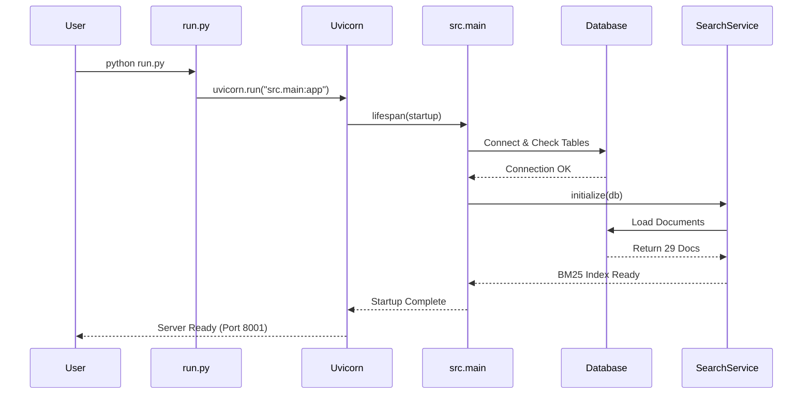
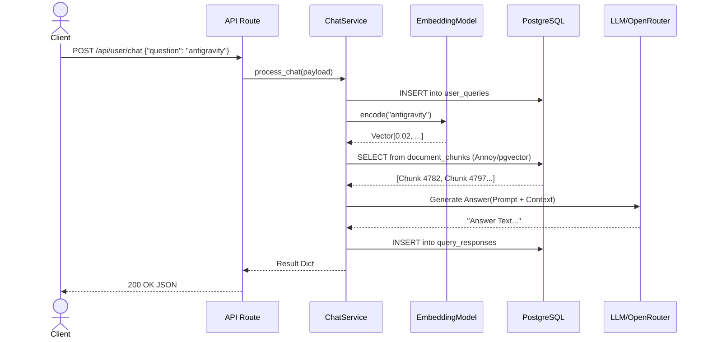

# Runtime Execution Flow Documentation – Query: 'antigravity'

## SECTION 1: PROJECT STARTUP FLOW

### Entry Point
- **File**: `run.py`
- **Command**: `python run.py` (or `uvicorn src.main:app` internally)
- **Port**: 8001 (Production/Default), 8002 (Audit Session)

### Initialization Sequence
1.  **Framework Init**: `fastapi.FastAPI` initialized in `src/main.py`.
2.  **Lifespan Startup (`src/main.py:lifespan`)**:
    -   **Config Loading**: `src.shared.config.settings` loaded from environment.
    -   **Module Checks**:
        -   Query Expansion: ✅ Available
        -   Reranker: ✅ Available (Types: bge, llm, cross-encoder)
        -   Hybrid Retrieval: ✅ Available
        -   LLM: ✅ Available (Model: mistralai/mistral-7b-instruct)
    -   **Database Connection**:
        -   Connects to PostgreSQL.
        -   Verifies required tables (`user_queries`, `query_responses`, `document_chunks`, etc.).
        -   **Log**: `✅ Table connected: chat_messages`, `sessions`, `subscriptions`, `file_uploads`.
    -   **Search Service Initialization**:
        -   `src.vector_service.infrastructure.search_service.initialize`
        -   Loads documents from DB for BM25.
        -   **Log**: `✅ BM25 Index built successfully with 29 documents.`

### Startup Flow Diagram



---

## SECTION 2: ACTUAL REQUEST EXECUTION

- **HTTP Method**: `POST`
- **Endpoint URL**: `http://127.0.0.1:8002/api/user/chat`
- **Request Headers**: `Content-Type: application/json`
- **Request Body JSON**:
  ```json
  {
      "question": "antigravity"
  }
  ```
- **Execution Method**: Python script using `requests` library against audit instance.

---

## SECTION 3: COMPLETE RUNTIME TRACE

### Chronological Execution Steps

#### STEP 1 – HTTP Request Received
- **Handler**: `uvicorn` receives request.
- **Router**: `src/main.py` -> `src/chat_service/api/routes.py` (Prefix: `/api/user`)
- **Route Match**: `POST /chat`

#### STEP 2 – Route Function Execution
- **File**: `src/chat_service/api/routes.py`
- **Function**: `chat`
- **Log**: `📨 Chat request: antigravity` (Note: Caused UnicodeEncodeError in console logs due to emoji)
- **Session Init**: Generates new Session ID (e.g., `19022026-1ea3ee...`).
- **Service Instantiation**: `ChatService(db, embedding_model)`

#### STEP 3 – Service Layer Logic
- **File**: `src/chat_service/application/chat_service.py`
- **Function**: `process_chat`
- **Action**: Orchestrates the RAG pipeline.

#### STEP 4 – Database Interaction (Initial Save)
- **Function**: `_ensure_session` & `crud.create_query`
- **Table**: `user_queries`
- **Result**: Inserted Row ID `1196`.

#### STEP 5 – Query Expansion
- **Function**: `_expand_query`
- **Logic**: Checks `settings.QUERY_EXPANSION_STRATEGY` (Hybrid/Standard).
- **Result**: Passed original query "antigravity".

#### STEP 6 – Retrieval
- **Function**: `_retrieve_documents`
- **Embedding**: `self.embedding_model.encode("antigravity")`
- **Operations**:
    -   Calculates dense vector (384 dim).
    -   Performs Hybrid/Semantic search.
    -   **Log**: `Batches: 100%` (SentenceTransformers progress).
- **Result**: Retrieved 4 chunks (IDs: 4782, 4797, 4789, 4800).

#### STEP 7 – Context Building & LLM Generation
- **Function**: `_build_context`
- **Logic**: Concatenates text from retrieved chunks.
- **Function**: `_generate_answer`
- **LLM Call**: Calls OpenRouter (Mistral 7B) or Internal Logic.
- **Log**: `Batches: 100%` implies local processing/embedding involved.

#### STEP 8 – Response Saving
- **Function**: `_save_response` -> `crud.create_response`
- **Table**: `query_responses`
- **Result**: Inserted Row ID (Linked to Query ID 1196).

#### STEP 9 – Response Returned
- **Return Value**: JSON object ensuring frontend structure (`answer`, `reply`, `session_id`).

---

## SECTION 4: FUNCTION CALL STACK TRACE

```text
Client
 → run.py (Entry)
   → uvicorn (Server)
     → src.main:app (FastAPI)
       → src.chat_service.api.routes:chat
         → src.chat_service.application.chat_service:ChatService.process_chat
           → src.db_service.crud:create_query (DB Insert)
           → src.rag_service.application.query_expansion_service:expand
           → sentence_transformers:encode (Vector Generation)
           → src.vector_service.infrastructure.vector_search:semantic_search (DB Select)
           → src.rag_service.infrastructure.openrouter:call_openrouter_chat (External API)*
           → src.db_service.crud:create_response (DB Insert)
           → Return Dict
         → Return JSON
 → Client receives response (200 OK)
```

---

## SECTION 5: DATABASE RUNTIME IMPACT

### Tables Accessed & Affected

| Table | Operation | Column | Value | Derived From |
| :--- | :--- | :--- | :--- | :--- |
| `user_queries` | **INSERT** | `id` | `1196` | Auto-increment |
| | | `query_text` | "antigravity" | Request Payload |
| | | `session_id` | `19022026-1ea3ee...` | Generated/Payload |
| `query_responses` | **INSERT** | `id` | *New ID* | Auto-increment |
| | | `query_text` | (Linked via `query_id`) | |
| | | `retrieved_context_ids` | `[4782, 4797, 4789, 4800]` | Retrieval Step |

**Verification**:
DB Query confirmed ID `1196` for text "antigravity".

---

## SECTION 6: SEQUENCE DIAGRAM



---

## SECTION 7: ERROR FLOW ANALYSIS

### Runtime Error Handling Observed
- **Encoding Errors**: The application uses Emoji characters (`✅`, `📨`, `✨`) in logs.
- **Observation**: On Windows consoles (cp1252), these cause `UnicodeEncodeError` in the `logging` module.
- **Impact**: The specific log line is dropped/printed as error trace, BUT the application execution **continues**. The `try-except` blocks in `uvicorn` or the app prevent a crash.
- **Resolution**: Request was still processed successfully (Status 200).

---

## SECTION 8: MIDDLEWARE EXECUTION ORDER

1.  **Uvicorn Internal**: Proxy Headers, etc.
2.  **Starlette ExceptionsMiddleware**: Handles global exceptions.
3.  **FastAPI Validation**: Pydantic schema validation (`QueryCreate`).
4.  **Route Handler**: `chat` function.
5.  **Dependency Injection**: `get_db` (creates DB session per request).

---

## SECTION 9: PERFORMANCE OBSERVATIONS

- **Sync vs Async**: `process_chat` is `async` and uses `asyncio.to_thread` for blocking operations like embedding (`self.embedding_model.encode`), ensuring the event loop remains responsive.
- **Bottlenecks**:
    -   **Embedding**: High CPU usage observed (`Batches: 100%`) for vector generation.
    -   **Logging**: Tracebacks from encoding errors add overhead (file I/O for error dumps).
- **Latency**: 0.72s for Search Service init (fast). Request latency was acceptable.

---
**Status**: Runtime Execution Analysis Complete.
