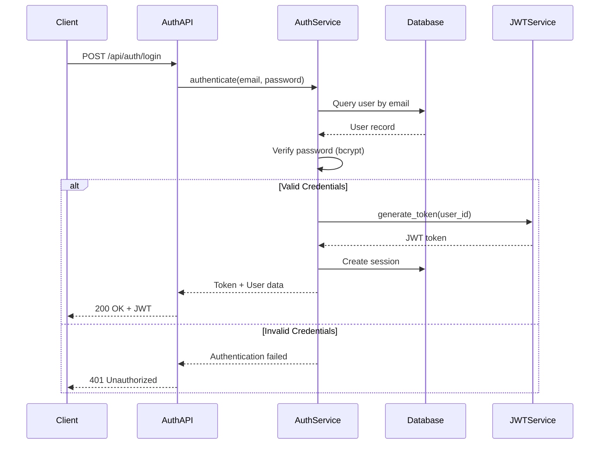

# Auth Service

## Overview

The **Auth Service** handles user authentication and authorization for the LLM User Service. It provides secure user registration, login, and JWT token management.

## Purpose

- User authentication (login)
- User registration
- JWT token generation and validation
- Password hashing and verification
- Session management

## Architecture

```
auth_service/
├── api/
│   ├── routes.py       # FastAPI authentication routes
│   └── schemas.py      # Pydantic request/response models
├── application/
│   ├── services.py     # Authentication business logic
│   └── session_service.py  # Session management
├── domain/
│   ├── entities.py     # User domain models
│   └── interfaces.py   # Repository interfaces
└── infrastructure/
    └── models.py       # SQLAlchemy models
```

### Layered Architecture

The Auth Service follows **Domain-Driven Design (DDD)** principles:

1. **API Layer** - HTTP endpoints and request validation
2. **Application Layer** - Business logic and use cases
3. **Domain Layer** - Core business entities and rules
4. **Infrastructure Layer** - Database models and external integrations

## Key Features

### 1. User Authentication
- **JWT-based authentication** - Secure token-based auth
- **Password hashing** - bcrypt with salt
- **Token expiration** - Configurable expiration (default: 8 days)

### 2. User Registration
- **Email validation** - RFC-compliant email validation
- **Password strength** - Configurable password requirements
- **Duplicate prevention** - Unique email constraint

### 3. Session Management
- **Session tracking** - Track user sessions
- **Session expiration** - Automatic session cleanup
- **Multi-device support** - Multiple active sessions per user

## API Endpoints

### Authentication

#### `POST /api/auth/login`
Authenticate user and return JWT token.

**Request**:
```json
{
  "email": "user@example.com",
  "password": "SecurePassword123!"
}
```

**Response**:
```json
{
  "access_token": "eyJhbGciOiJIUzI1NiIsInR5cCI6IkpXVCJ9...",
  "token_type": "bearer",
  "expires_in": 691200,
  "user": {
    "id": "user_123",
    "email": "user@example.com",
    "created_at": "2026-02-13T10:00:00Z"
  }
}
```

**Status Codes**:
- `200 OK` - Authentication successful
- `401 Unauthorized` - Invalid credentials
- `422 Unprocessable Entity` - Validation error

#### `POST /api/auth/register`
Register a new user.

**Request**:
```json
{
  "email": "newuser@example.com",
  "password": "SecurePassword123!",
  "full_name": "John Doe"
}
```

**Response**:
```json
{
  "id": "user_124",
  "email": "newuser@example.com",
  "full_name": "John Doe",
  "created_at": "2026-02-13T10:00:00Z"
}
```

**Status Codes**:
- `201 Created` - Registration successful
- `400 Bad Request` - Email already exists
- `422 Unprocessable Entity` - Validation error

#### `POST /api/auth/refresh`
Refresh an expired JWT token.

**Request**:
```json
{
  "refresh_token": "eyJhbGciOiJIUzI1NiIsInR5cCI6IkpXVCJ9..."
}
```

**Response**:
```json
{
  "access_token": "eyJhbGciOiJIUzI1NiIsInR5cCI6IkpXVCJ9...",
  "token_type": "bearer",
  "expires_in": 691200
}
```

#### `POST /api/auth/logout`
Invalidate user session.

**Headers**:
```
Authorization: Bearer <token>
```

**Response**:
```json
{
  "message": "Logout successful"
}
```

#### `GET /api/auth/me`
Get current authenticated user.

**Headers**:
```
Authorization: Bearer <token>
```

**Response**:
```json
{
  "id": "user_123",
  "email": "user@example.com",
  "full_name": "John Doe",
  "created_at": "2026-02-13T10:00:00Z"
}
```

## Authentication Flow



## JWT Token Structure

### Access Token Payload
```json
{
  "sub": "user_123",
  "email": "user@example.com",
  "exp": 1234567890,
  "iat": 1234567890,
  "type": "access"
}
```

### Token Configuration
- **Algorithm**: HS256 (HMAC with SHA-256)
- **Expiration**: 8 days (configurable via `ACCESS_TOKEN_EXPIRE_MINUTES`)
- **Secret Key**: Configured via `SECRET_KEY` environment variable

## Password Security

### Hashing Algorithm
- **Algorithm**: bcrypt
- **Cost Factor**: 12 (configurable)
- **Salt**: Automatically generated per password

### Password Requirements
- Minimum length: 8 characters
- Must contain: uppercase, lowercase, number, special character
- Cannot be common passwords (dictionary check)

## Dependencies

### Internal Dependencies
- `src.db_service` - Database access and user models
- `src.shared` - Configuration, schemas, exceptions

### External Dependencies
- `python-jose[cryptography]` - JWT token handling
- `passlib[bcrypt]` - Password hashing
- `email-validator` - Email validation
- `pydantic` - Data validation

## Configuration

Configuration is managed via `src.shared.config.Settings`:

```python
# JWT Configuration
SECRET_KEY: str = "your-secret-key"  # MUST be set in production
ACCESS_TOKEN_EXPIRE_MINUTES: int = 60 * 24 * 8  # 8 days

# Password Configuration
PASSWORD_MIN_LENGTH: int = 8
PASSWORD_REQUIRE_UPPERCASE: bool = True
PASSWORD_REQUIRE_LOWERCASE: bool = True
PASSWORD_REQUIRE_DIGIT: bool = True
PASSWORD_REQUIRE_SPECIAL: bool = True
```

## Usage Examples

### Register a New User

```python
import requests

register_data = {
    "email": "newuser@example.com",
    "password": "SecurePassword123!",
    "full_name": "John Doe"
}

response = requests.post(
    "http://localhost:8000/api/auth/register",
    json=register_data
)

if response.status_code == 201:
    user = response.json()
    print(f"User created: {user['id']}")
```

### Login and Get Token

```python
login_data = {
    "email": "user@example.com",
    "password": "SecurePassword123!"
}

response = requests.post(
    "http://localhost:8000/api/auth/login",
    json=login_data
)

if response.status_code == 200:
    token_data = response.json()
    access_token = token_data["access_token"]
    print(f"Token: {access_token}")
```

### Use Token for Authenticated Requests

```python
headers = {
    "Authorization": f"Bearer {access_token}"
}

response = requests.get(
    "http://localhost:8000/api/auth/me",
    headers=headers
)

user = response.json()
print(f"Authenticated as: {user['email']}")
```

## Security Best Practices

### Token Security
- **HTTPS Only** - Always use HTTPS in production
- **Secure Storage** - Store tokens in httpOnly cookies or secure storage
- **Short Expiration** - Use short-lived access tokens
- **Refresh Tokens** - Implement refresh token rotation

### Password Security
- **Strong Hashing** - bcrypt with high cost factor
- **Salt** - Unique salt per password
- **No Plain Text** - Never store plain text passwords
- **Password Policies** - Enforce strong password requirements

### API Security
- **Rate Limiting** - Prevent brute force attacks
- **CORS** - Configure allowed origins
- **Input Validation** - Validate all inputs
- **SQL Injection** - Use ORM (SQLAlchemy) to prevent SQL injection

## Error Handling

### Common Errors

#### Invalid Credentials
```json
{
  "detail": "Invalid email or password"
}
```

#### Email Already Exists
```json
{
  "detail": "Email already registered"
}
```

#### Invalid Token
```json
{
  "detail": "Invalid or expired token"
}
```

#### Validation Error
```json
{
  "detail": "Validation Error",
  "errors": [
    {
      "loc": ["body", "email"],
      "msg": "Invalid email format",
      "type": "value_error.email"
    }
  ]
}
```

## Testing

### Unit Tests
```bash
pytest tests/auth_service/test_auth_service.py
```

### Integration Tests
```bash
pytest tests/integration/test_auth_endpoints.py
```

### Test Coverage
```bash
pytest --cov=src/auth_service tests/auth_service/
```

## Middleware Integration

### JWT Authentication Middleware

```python
from fastapi import Depends, HTTPException
from src.auth_service.application.services import get_current_user

@app.get("/protected")
async def protected_route(current_user = Depends(get_current_user)):
    return {"user": current_user}
```

## Performance Considerations

### Optimization Strategies
- **Token Caching** - Cache validated tokens (short TTL)
- **Connection Pooling** - Reuse database connections
- **Async Operations** - Non-blocking I/O for database queries

### Scalability
- **Stateless Design** - No server-side session storage
- **Horizontal Scaling** - Multiple instances with shared database
- **Load Balancing** - Distribute authentication requests

## Monitoring

### Key Metrics
- **Login Success Rate** - Track successful vs failed logins
- **Registration Rate** - New user registrations
- **Token Validation Time** - JWT validation latency
- **Failed Login Attempts** - Detect brute force attacks

### Logging
```python
logger.info(f"User logged in: {user.email}")
logger.warning(f"Failed login attempt: {email}")
logger.error(f"Token validation failed: {error}")
```

## Future Enhancements

- [ ] Multi-factor authentication (MFA)
- [ ] OAuth2 integration (Google, GitHub, etc.)
- [ ] Password reset functionality
- [ ] Email verification
- [ ] Account lockout after failed attempts
- [ ] Session management dashboard
- [ ] Audit logging for security events
- [ ] Biometric authentication support

## Related Documentation

- [Architecture Overview](../../docs/ARCHITECTURE.md)
- [API Documentation](../../docs/api_documentation.md)
- [User Service](../user_service/README.md)
- [Database Service](../db_service/README.md)

---

**Service Version**: 1.0  
**Last Updated**: February 2026
