# Chat Service

## Overview

The **Chat Service** is the core orchestrator of the RAG (Retrieval-Augmented Generation) pipeline. It handles user queries, coordinates retrieval, reranking, and LLM generation to produce intelligent responses.

## Purpose

- Process user chat queries
- Orchestrate the complete RAG pipeline
- Manage chat sessions and conversation history
- Coordinate retrieval, reranking, and generation
- Return formatted responses to users

## Architecture

```
chat_service/
├── api/
│   └── routes.py           # FastAPI chat endpoints
├── application/
│   └── chat_service.py     # ChatService orchestrator
├── domain/
│   └── (entities)          # Chat domain models
└── infrastructure/
    └── (adapters)          # External integrations
```

### Design Pattern

The Chat Service implements the **Controller/Orchestrator Pattern**:
- **ChatService** - Orchestrates the entire RAG pipeline
- **Routes** - Handle HTTP requests and responses
- **Dependencies** - Inject services (vector, RAG, LLM)

## Key Features

### 1. RAG Pipeline Orchestration
- **Query Processing** - Validate and prepare queries
- **Retrieval** - Dense, sparse, or hybrid search
- **Reranking** - Improve result relevance
- **Generation** - LLM-based response generation

### 2. Session Management
- **Session Creation** - Auto-generate or use provided session IDs
- **Conversation History** - Track queries and responses
- **Temporary Sessions** - Support ephemeral conversations

### 3. Multi-Modal Retrieval
- **Dense Search** - Vector similarity (pgvector)
- **Sparse Search** - Keyword matching (BM25)
- **Hybrid Search** - Combines both methods

### 4. Query Enhancement
- **Query Expansion** - Multiple expansion strategies
- **Language Detection** - Multi-language support
- **Tagging** - Extract key terms

## API Endpoints

### Chat Endpoints

#### `POST /api/chat`
Simplified chat endpoint for conversational interface.

**Request**:
```json
{
  "question": "What is RAG?",
  "session_id": "13022026-abc123",
  "user_id": "user_123",
  "is_temporary": false,
  "language": "en"
}
```

**Query Parameters**:
- `reranking_enabled` (bool, default: true) - Enable reranking
- `reranker_type` (string, optional) - Reranker type (cross-encoder, cohere, bge, llm)
- `limit` (int, default: 5) - Number of chunks to retrieve
- `hybrid_retrieval_enabled` (bool, default: true) - Enable hybrid search

**Response**:
```json
{
  "status": "success",
  "answer": "RAG stands for Retrieval-Augmented Generation...",
  "reply": "RAG stands for Retrieval-Augmented Generation...",
  "important_words": ["RAG", "retrieval", "generation"],
  "language_response": "en",
  "tags": ["AI", "NLP"],
  "query_id": 123,
  "response_id": 456,
  "message_id": 789,
  "session_id": "13022026-abc123"
}
```

#### `POST /api/query`
Full RAG pipeline endpoint with all configuration options.

**Request**:
```json
{
  "query_text": "What is RAG?",
  "session_id": "13022026-abc123",
  "user_id": "user_123",
  "is_temporary": false,
  "language": "en"
}
```

**Query Parameters**:
- `query_expansion_enabled` (bool, default: true) - Enable query expansion
- `expansion_strategy` (string, optional) - Expansion strategy (static, llm, hybrid, module_wise, token_optimized)
- `reranking_enabled` (bool, default: true) - Enable reranking
- `hybrid_retrieval_enabled` (bool, default: true) - Enable hybrid search
- `reranker_type` (string, optional) - Reranker type
- `limit` (int, default: 5) - Number of chunks to retrieve

**Response**:
```json
{
  "answer": "RAG stands for Retrieval-Augmented Generation...",
  "query_id": 123,
  "response_id": 456,
  "message_id": 789,
  "session_id": "13022026-abc123",
  "retrieved_chunks": 5,
  "latency_ms": 1500,
  "llm_model": "mistralai/mistral-7b-instruct"
}
```

## RAG Pipeline Flow

```mermaid
flowchart LR
    INPUT[User Query] --> VALIDATE{Valid?}
    VALIDATE -->|No| ERROR[Return Error]
    VALIDATE -->|Yes| SESSION[Session Setup]
    
    SESSION --> SAVE[Save Query]
    SAVE --> EXPAND{Query<br/>Expansion?}
    
    EXPAND -->|Yes| EXPANSION[Expand Query]
    EXPAND -->|No| EMBED
    EXPANSION --> EMBED[Generate Embedding]
    
    EMBED --> RETRIEVE{Retrieval<br/>Mode}
    RETRIEVE -->|Dense| DENSE[Vector Search]
    RETRIEVE -->|Hybrid| HYBRID[Hybrid Search]
    
    DENSE --> CHUNKS
    HYBRID --> CHUNKS[Retrieved Chunks]
    
    CHUNKS --> RERANK{Reranking?}
    RERANK -->|Yes| RERANKER[Rerank Results]
    RERANK -->|No| CONTEXT
    RERANKER --> CONTEXT[Build Context]
    
    CONTEXT --> PROMPT[Build Prompt]
    PROMPT --> LLM[LLM Generation]
    LLM --> RESPONSE[Save Response]
    RESPONSE --> RETURN[Return to User]
    
    style INPUT fill:#4CAF50,color:#fff
    style EXPANSION fill:#2196F3,color:#fff
    style HYBRID fill:#2196F3,color:#fff
    style RERANKER fill:#9C27B0,color:#fff
    style LLM fill:#FF9800,color:#fff
    style RETURN fill:#4CAF50,color:#fff
```



## ChatService Class

### Main Method: `process_chat()`

```python
async def process_chat(
    payload: schemas.QueryCreate,
    reranking_enabled: bool = True,
    reranker_type: str = None,
    limit: int = 5,
    hybrid_retrieval_enabled: bool = True,
    query_expansion_enabled: bool = True,
    expansion_strategy: str = None
) -> dict:
    """
    Process a chat query through the complete RAG pipeline.
    
    Args:
        payload: Query data (text, session, user)
        reranking_enabled: Enable reranking
        reranker_type: Type of reranker to use
        limit: Number of chunks to retrieve
        hybrid_retrieval_enabled: Use hybrid search
        query_expansion_enabled: Expand query
        expansion_strategy: Strategy for expansion
    
    Returns:
        dict: Response with answer, IDs, metadata
    """
```

### Pipeline Stages

#### 1. Query Processing
```python
# Validate input
question = payload.query_text
if not question:
    raise HTTPException(400, "Missing query text")

# Setup session
session_id = payload.session_id or generate_session_id()
```

#### 2. Query Expansion (Optional)
```python
if query_expansion_enabled:
    expanded_queries = expansion_service.expand_query(
        question,
        strategy=expansion_strategy
    )
```

#### 3. Retrieval
```python
if hybrid_retrieval_enabled:
    chunks = hybrid_retrieve(question, limit=limit)
else:
    embedding = embedding_model.encode(question)
    chunks = dense_search(embedding, limit=limit)
```

#### 4. Reranking (Optional)
```python
if reranking_enabled:
    chunks = reranking_service.rerank(
        question,
        chunks,
        reranker_type=reranker_type
    )
```

#### 5. LLM Generation
```python
context = build_context(chunks)
prompt = build_prompt(question, context)
response = llm_service.generate(prompt)
```

#### 6. Persistence
```python
# Save query
query_record = save_query(payload)

# Save response
response_record = save_response(query_record.id, response)

# Save message
message_record = save_message(session_id, query_record.id, response_record.id)
```

## Dependencies

### Internal Dependencies
- `src.db_service` - Database access and models
- `src.vector_service` - Vector search operations
- `src.rag_service` - Query expansion, reranking, LLM
- `src.shared` - Schemas, configuration

### External Dependencies
- `sentence-transformers` - Embedding generation
- `fastapi` - Web framework
- `sqlalchemy` - Database ORM

## Configuration

### Environment Variables
```python
# Retrieval Configuration
EMBEDDING_MODEL_NAME: str = "all-MiniLM-L6-v2"
MAX_CONTEXT_CHARS: int = 10000

# Feature Flags
ENABLE_HYBRID_SEARCH: bool = True
ENABLE_RERANKING: bool = True
ENABLE_QUERY_EXPANSION: bool = True

# Query Expansion
QUERY_EXPANSION_STRATEGY: str = "hybrid"

# Reranking
RERANKING_MODEL_NAME: str = "cross-encoder/ms-marco-MiniLM-L-6-v2"
```

## Usage Examples

### Simple Chat Request

```python
import requests

chat_data = {
    "question": "What is RAG?",
    "session_id": "13022026-abc123"
}

response = requests.post(
    "http://localhost:8000/api/chat",
    json=chat_data
)

result = response.json()
print(f"Answer: {result['answer']}")
```

### Full RAG Pipeline with Options

```python
query_data = {
    "query_text": "Explain vector databases",
    "session_id": "13022026-abc123",
    "user_id": "user_123"
}

params = {
    "query_expansion_enabled": True,
    "expansion_strategy": "hybrid",
    "reranking_enabled": True,
    "reranker_type": "cross-encoder",
    "hybrid_retrieval_enabled": True,
    "limit": 10
}

response = requests.post(
    "http://localhost:8000/api/query",
    json=query_data,
    params=params
)

result = response.json()
print(f"Answer: {result['answer']}")
print(f"Latency: {result['latency_ms']}ms")
print(f"Model: {result['llm_model']}")
```

### Continue Conversation

```python
# First message
chat_data = {
    "question": "What is RAG?",
    "session_id": "13022026-abc123"
}
response1 = requests.post("http://localhost:8000/api/chat", json=chat_data)

# Follow-up message (same session)
chat_data = {
    "question": "How does it work?",
    "session_id": "13022026-abc123"  # Same session ID
}
response2 = requests.post("http://localhost:8000/api/chat", json=chat_data)
```

## Error Handling

### Common Errors

#### Missing Query Text
```json
{
  "detail": "Missing 'question' field"
}
```

#### Embedding Model Not Loaded
```json
{
  "detail": "Embedding model not available"
}
```

#### LLM API Error
```json
{
  "detail": "LLM generation failed: API error"
}
```

#### Database Error
```json
{
  "detail": "Failed to save query: Database connection error"
}
```

## Performance Optimization

### Caching Strategies
- **Embedding Cache** - Cache query embeddings
- **Response Cache** - Cache frequent queries
- **Model Cache** - Keep models in memory

### Async Operations
```python
# Parallel retrieval and expansion
async def process_chat():
    embedding_task = asyncio.create_task(generate_embedding(query))
    expansion_task = asyncio.create_task(expand_query(query))
    
    embedding, expanded = await asyncio.gather(
        embedding_task,
        expansion_task
    )
```

### Batch Processing
```python
# Process multiple queries in batch
embeddings = embedding_model.encode([q1, q2, q3])
```

## Monitoring

### Key Metrics
- **Request Latency** - Time to process query
- **Retrieval Accuracy** - Relevance of retrieved chunks
- **LLM Token Usage** - Prompt and completion tokens
- **Error Rate** - Failed requests

### Logging
```python
logger.info(f"📨 Chat request: {question[:100]}")
logger.info(f"✅ Retrieved {len(chunks)} chunks")
logger.info(f"⏱️ Total latency: {latency_ms}ms")
logger.error(f"❌ Chat error: {error}")
```

## Testing

### Unit Tests
```bash
pytest tests/chat_service/test_chat_service.py
```

### Integration Tests
```bash
pytest tests/integration/test_chat_endpoints.py
```

### Load Testing
```bash
locust -f tests/load/test_chat_load.py
```

## Future Enhancements

- [ ] Streaming responses (SSE)
- [ ] Multi-turn conversation context
- [ ] Conversation summarization
- [ ] User feedback integration
- [ ] A/B testing for retrieval strategies
- [ ] Advanced caching (Redis)
- [ ] Real-time analytics
- [ ] Conversation export

## Related Documentation

- [Architecture Overview](../../docs/ARCHITECTURE.md)
- [RAG Service](../rag_service/README.md)
- [Vector Service](../vector_service/README.md)
- [Database Service](../db_service/README.md)

---

**Service Version**: 1.0  
**Last Updated**: February 2026
