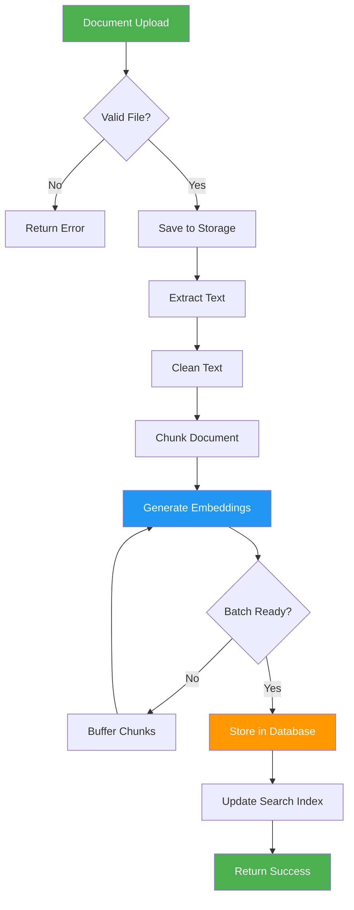

# Ingestion Service

## Overview

The **Ingestion Service** handles document upload, processing, chunking, embedding generation, and storage in the vector database. It transforms raw documents into searchable vector embeddings.

## Purpose

- Document upload and validation
- Text extraction and cleaning
- Document chunking
- Embedding generation
- Vector storage (pgvector)
- Metadata management

## Architecture

```
ingestion_service/
├── api/
│   └── routes.py               # Upload and ingestion endpoints
├── application/
│   ├── cleaning/
│   │   └── services.py         # Text cleaning
│   └── folder_service.py       # Folder management
├── domain/
│   └── (entities)              # Document domain models
└── infrastructure/
    └── (adapters)              # File storage, external services
```

## Key Features

### 1. Document Processing
- **Multi-format Support** - PDF, TXT, DOCX, MD
- **Text Extraction** - Extract text from various formats
- **Text Cleaning** - Remove noise, normalize text
- **Metadata Extraction** - Extract document metadata

### 2. Chunking
- **Smart Chunking** - Semantic-aware text splitting
- **Configurable Size** - Adjustable chunk size
- **Overlap** - Chunk overlap for context preservation
- **Metadata Preservation** - Track chunk source and position

### 3. Embedding Generation
- **Sentence Transformers** - Generate vector embeddings
- **Batch Processing** - Efficient batch embedding
- **Dimension Validation** - Ensure correct embedding dimension

### 4. Storage
- **pgvector** - Store embeddings in PostgreSQL
- **Metadata Storage** - Store document and chunk metadata
- **Deduplication** - Prevent duplicate documents

## Ingestion Pipeline



## API Endpoints

### Document Ingestion

#### `POST /api/ingest`
Upload and process a document.

**Request** (multipart/form-data):
```
file: <binary file>
source_name: "document.pdf"
metadata: {"author": "John Doe", "category": "AI"}
```

**Response**:
```json
{
  "status": "success",
  "document_id": "doc_123",
  "chunks_created": 25,
  "embeddings_generated": 25,
  "processing_time_ms": 5000
}
```

#### `POST /api/ingest/folder`
Upload and process multiple documents from a folder.

**Request** (multipart/form-data):
```
files: [<file1>, <file2>, <file3>]
folder_name: "AI Documents"
```

**Response**:
```json
{
  "status": "success",
  "documents_processed": 3,
  "total_chunks": 75,
  "failed_documents": []
}
```

#### `GET /api/documents`
List all ingested documents.

**Response**:
```json
{
  "documents": [
    {
      "id": "doc_123",
      "source_name": "document.pdf",
      "chunks_count": 25,
      "uploaded_at": "2026-02-13T10:00:00Z"
    }
  ],
  "total": 1
}
```

#### `GET /api/documents/{document_id}`
Get document details.

**Response**:
```json
{
  "id": "doc_123",
  "source_name": "document.pdf",
  "file_path": "/uploads/document.pdf",
  "chunks_count": 25,
  "metadata": {
    "author": "John Doe",
    "category": "AI"
  },
  "uploaded_at": "2026-02-13T10:00:00Z"
}
```

#### `DELETE /api/documents/{document_id}`
Delete a document and its chunks.

**Response**:
```json
{
  "status": "success",
  "chunks_deleted": 25
}
```

## Processing Pipeline

### 1. Text Extraction

```python
def extract_text(file_path: str, file_type: str) -> str:
    """Extract text from various file formats."""
    if file_type == "pdf":
        return extract_pdf_text(file_path)
    elif file_type == "docx":
        return extract_docx_text(file_path)
    elif file_type == "txt":
        return extract_txt_text(file_path)
    elif file_type == "md":
        return extract_markdown_text(file_path)
    else:
        raise ValueError(f"Unsupported file type: {file_type}")
```

### 2. Text Cleaning

```python
from src.ingestion_service.application.cleaning.services import clean_text

def clean_text(text: str) -> str:
    """
    Clean and normalize text.
    
    - Remove extra whitespace
    - Normalize unicode characters
    - Remove special characters
    - Fix encoding issues
    """
    # Remove extra whitespace
    text = re.sub(r'\s+', ' ', text)
    
    # Normalize unicode
    text = unicodedata.normalize('NFKD', text)
    
    # Remove control characters
    text = ''.join(char for char in text if not unicodedata.category(char).startswith('C'))
    
    return text.strip()
```

### 3. Chunking

```python
def chunk_document(
    text: str,
    chunk_size: int = 500,
    chunk_overlap: int = 50
) -> List[str]:
    """
    Split document into chunks with overlap.
    
    Args:
        text: Document text
        chunk_size: Target chunk size in characters
        chunk_overlap: Overlap between chunks
    
    Returns:
        List of text chunks
    """
    chunks = []
    start = 0
    
    while start < len(text):
        end = start + chunk_size
        chunk = text[start:end]
        
        # Try to break at sentence boundary
        if end < len(text):
            last_period = chunk.rfind('.')
            if last_period > chunk_size * 0.5:  # At least 50% of chunk size
                end = start + last_period + 1
                chunk = text[start:end]
        
        chunks.append(chunk.strip())
        start = end - chunk_overlap
    
    return chunks
```

### 4. Embedding Generation

```python
from sentence_transformers import SentenceTransformer

def generate_embeddings(chunks: List[str]) -> List[List[float]]:
    """
    Generate embeddings for text chunks.
    
    Args:
        chunks: List of text chunks
    
    Returns:
        List of embedding vectors
    """
    model = SentenceTransformer("all-MiniLM-L6-v2")
    
    # Batch encode for efficiency
    embeddings = model.encode(
        chunks,
        batch_size=32,
        show_progress_bar=True,
        convert_to_numpy=True
    )
    
    return embeddings.tolist()
```

### 5. Storage

```python
def store_chunks(
    db: Session,
    chunks: List[str],
    embeddings: List[List[float]],
    source_name: str,
    file_path: str,
    metadata: dict = None
) -> List[int]:
    """
    Store chunks and embeddings in database.
    
    Args:
        db: Database session
        chunks: Text chunks
        embeddings: Embedding vectors
        source_name: Document name
        file_path: File path
        metadata: Additional metadata
    
    Returns:
        List of created chunk IDs
    """
    chunk_ids = []
    
    for i, (chunk, embedding) in enumerate(zip(chunks, embeddings)):
        chunk_record = models.DocumentChunk(
            chunk_text=chunk,
            embedding=embedding,
            source_name=source_name,
            file_path=file_path,
            chunk_index=i,
            metadata=metadata or {}
        )
        db.add(chunk_record)
        db.flush()
        chunk_ids.append(chunk_record.id)
    
    db.commit()
    return chunk_ids
```

## Configuration

### Environment Variables

```python
# Upload Configuration
UPLOAD_DIR: str = "uploads"
MAX_UPLOAD_SIZE: int = 10 * 1024 * 1024  # 10MB

# Chunking Configuration
CHUNK_SIZE: int = 500
CHUNK_OVERLAP: int = 50

# Embedding Configuration
EMBEDDING_MODEL_NAME: str = "all-MiniLM-L6-v2"
EXPECTED_EMBEDDING_DIM: int = 384
EMBEDDING_BATCH_SIZE: int = 32
```

### Supported File Types

```python
SUPPORTED_FILE_TYPES = {
    "pdf": "application/pdf",
    "txt": "text/plain",
    "docx": "application/vnd.openxmlformats-officedocument.wordprocessingml.document",
    "md": "text/markdown"
}
```

## Usage Examples

### Upload Single Document

```python
import requests

files = {
    'file': open('document.pdf', 'rb')
}

data = {
    'source_name': 'AI Research Paper',
    'metadata': '{"author": "John Doe", "year": 2026}'
}

response = requests.post(
    'http://localhost:8000/api/ingest',
    files=files,
    data=data
)

result = response.json()
print(f"Chunks created: {result['chunks_created']}")
```

### Upload Multiple Documents

```python
files = [
    ('files', open('doc1.pdf', 'rb')),
    ('files', open('doc2.pdf', 'rb')),
    ('files', open('doc3.pdf', 'rb'))
]

data = {
    'folder_name': 'AI Research'
}

response = requests.post(
    'http://localhost:8000/api/ingest/folder',
    files=files,
    data=data
)

result = response.json()
print(f"Documents processed: {result['documents_processed']}")
```

### List Documents

```python
response = requests.get('http://localhost:8000/api/documents')
documents = response.json()['documents']

for doc in documents:
    print(f"{doc['source_name']}: {doc['chunks_count']} chunks")
```

### Delete Document

```python
document_id = "doc_123"
response = requests.delete(f'http://localhost:8000/api/documents/{document_id}')
result = response.json()
print(f"Deleted {result['chunks_deleted']} chunks")
```

## Error Handling

### File Validation Errors

```json
{
  "detail": "File type not supported. Allowed: pdf, txt, docx, md"
}
```

### Size Limit Errors

```json
{
  "detail": "File size exceeds maximum allowed size of 10MB"
}
```

### Processing Errors

```json
{
  "detail": "Failed to extract text from PDF: Corrupted file"
}
```

## Performance Optimization

### Batch Processing

```python
# Process multiple documents in parallel
from concurrent.futures import ThreadPoolExecutor

def process_documents_parallel(files: List[str]):
    with ThreadPoolExecutor(max_workers=4) as executor:
        results = executor.map(process_document, files)
    return list(results)
```

### Async Processing

```python
import asyncio

async def process_document_async(file_path: str):
    # Extract text (I/O bound)
    text = await asyncio.to_thread(extract_text, file_path)
    
    # Clean and chunk (CPU bound)
    cleaned = clean_text(text)
    chunks = chunk_document(cleaned)
    
    # Generate embeddings (CPU bound)
    embeddings = await asyncio.to_thread(generate_embeddings, chunks)
    
    return chunks, embeddings
```

### Caching

```python
from functools import lru_cache

@lru_cache(maxsize=100)
def get_embedding_model():
    return SentenceTransformer("all-MiniLM-L6-v2")
```

## Monitoring

### Metrics

```python
logger.info(f"Document uploaded: {source_name}")
logger.info(f"Text extracted: {len(text)} characters")
logger.info(f"Chunks created: {len(chunks)}")
logger.info(f"Embeddings generated: {len(embeddings)}")
logger.info(f"Processing time: {processing_time:.2f}s")
```

## Testing

### Unit Tests

```bash
pytest tests/ingestion_service/test_text_extraction.py
pytest tests/ingestion_service/test_chunking.py
pytest tests/ingestion_service/test_embedding.py
```

### Integration Tests

```bash
pytest tests/integration/test_ingestion_pipeline.py
```

## Future Enhancements

- [ ] OCR support for scanned documents
- [ ] Image and table extraction
- [ ] Multi-language document support
- [ ] Incremental updates (update existing documents)
- [ ] Document versioning
- [ ] Advanced chunking strategies (semantic chunking)
- [ ] Distributed processing (Celery)
- [ ] Real-time ingestion (streaming)

## Related Documentation

- [Architecture Overview](../../docs/ARCHITECTURE.md)
- [Vector Service](../vector_service/README.md)
- [DB Service](../db_service/README.md)

---

**Service Version**: 1.0  
**Last Updated**: February 2026
