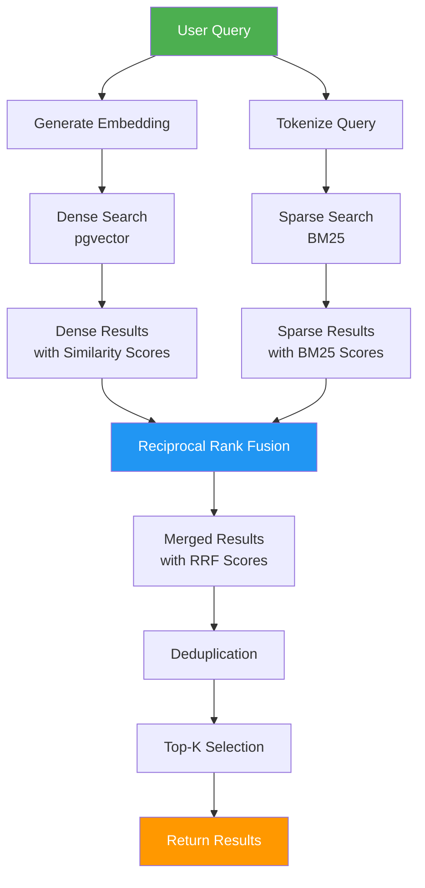

# Vector Service

## Overview

The **Vector Service** provides vector search capabilities, hybrid retrieval, and BM25 sparse search for the LLM User Service. It manages embedding-based semantic search and combines it with keyword-based search for optimal retrieval.

## Purpose

- Dense vector search (pgvector)
- Sparse keyword search (BM25)
- Hybrid retrieval (combines dense + sparse)
- Search service initialization
- Result merging and ranking

## Architecture

```
vector_service/
├── infrastructure/
│   ├── search_service.py       # BM25 search implementation
│   └── hybrid_retrieval.py     # Hybrid search orchestration
└── (other components)
```

## Key Features

### 1. Dense Vector Search
- **pgvector Integration** - PostgreSQL vector extension
- **Cosine Similarity** - Semantic similarity search
- **HNSW Indexing** - Fast approximate nearest neighbor search

### 2. Sparse Search (BM25)
- **Keyword Matching** - Traditional IR algorithm
- **TF-IDF Based** - Term frequency-inverse document frequency
- **In-Memory Index** - Fast keyword search

### 3. Hybrid Retrieval
- **Reciprocal Rank Fusion (RRF)** - Combines dense and sparse results
- **Configurable Weights** - Adjust dense/sparse balance
- **Deduplication** - Remove duplicate results

## Components

### Dense Vector Search

#### pgvector Search

```python
from sqlalchemy import text
from src.db_service.database import engine

def dense_search_pgvector(
    query_embedding: List[float],
    limit: int = 5,
    threshold: float = None
) -> List[dict]:
    """
    Perform dense vector search using pgvector.
    
    Args:
        query_embedding: Query vector (384-dim)
        limit: Number of results to return
        threshold: Optional similarity threshold
    
    Returns:
        List of matching chunks with scores
    """
    with engine.connect() as conn:
        query = text("""
            SELECT 
                id,
                chunk_text,
                source_name,
                file_path,
                chunk_index,
                metadata,
                embedding <=> :query_embedding AS distance
            FROM document_chunks
            WHERE (:threshold IS NULL OR embedding <=> :query_embedding < :threshold)
            ORDER BY embedding <=> :query_embedding
            LIMIT :limit
        """)
        
        results = conn.execute(
            query,
            {
                "query_embedding": query_embedding,
                "limit": limit,
                "threshold": threshold
            }
        ).fetchall()
        
        return [
            {
                "id": r.id,
                "chunk_text": r.chunk_text,
                "source_name": r.source_name,
                "file_path": r.file_path,
                "chunk_index": r.chunk_index,
                "metadata": r.metadata,
                "score": 1 - r.distance  # Convert distance to similarity
            }
            for r in results
        ]
```

#### Vector Operators

pgvector supports multiple distance operators:
- `<=>` - Cosine distance
- `<->` - Euclidean distance (L2)
- `<#>` - Inner product

### Sparse Search (BM25)

#### Search Service

```python
from rank_bm25 import BM25Okapi
from src.vector_service.infrastructure.search_service import SearchService

class SearchService:
    def __init__(self):
        self.bm25 = None
        self.documents = []
        self.doc_ids = []
    
    def initialize(self, db):
        """Initialize BM25 index from database."""
        chunks = db.query(DocumentChunk).all()
        
        self.documents = [chunk.chunk_text for chunk in chunks]
        self.doc_ids = [chunk.id for chunk in chunks]
        
        # Tokenize documents
        tokenized_docs = [doc.lower().split() for doc in self.documents]
        
        # Build BM25 index
        self.bm25 = BM25Okapi(tokenized_docs)
    
    def search(self, query: str, top_k: int = 5) -> List[dict]:
        """
        Perform BM25 search.
        
        Args:
            query: Search query
            top_k: Number of results
        
        Returns:
            List of matching chunks with BM25 scores
        """
        if not self.bm25:
            return []
        
        # Tokenize query
        tokenized_query = query.lower().split()
        
        # Get BM25 scores
        scores = self.bm25.get_scores(tokenized_query)
        
        # Get top-k results
        top_indices = sorted(
            range(len(scores)),
            key=lambda i: scores[i],
            reverse=True
        )[:top_k]
        
        return [
            {
                "id": self.doc_ids[i],
                "chunk_text": self.documents[i],
                "score": float(scores[i])
            }
            for i in top_indices
        ]

# Singleton instance
_search_service = None

def get_search_service() -> SearchService:
    global _search_service
    if _search_service is None:
        _search_service = SearchService()
    return _search_service
```

### Hybrid Retrieval

#### Reciprocal Rank Fusion (RRF)

```python
def reciprocal_rank_fusion(
    dense_results: List[dict],
    sparse_results: List[dict],
    k: int = 60
) -> List[dict]:
    """
    Combine dense and sparse results using RRF.
    
    RRF Formula: score = sum(1 / (k + rank))
    
    Args:
        dense_results: Results from vector search
        sparse_results: Results from BM25 search
        k: RRF constant (default: 60)
    
    Returns:
        Merged and ranked results
    """
    scores = {}
    
    # Add dense scores
    for rank, result in enumerate(dense_results, 1):
        doc_id = result['id']
        scores[doc_id] = scores.get(doc_id, 0) + 1 / (k + rank)
    
    # Add sparse scores
    for rank, result in enumerate(sparse_results, 1):
        doc_id = result['id']
        scores[doc_id] = scores.get(doc_id, 0) + 1 / (k + rank)
    
    # Sort by combined score
    ranked_ids = sorted(scores.keys(), key=lambda x: scores[x], reverse=True)
    
    # Build result list
    id_to_result = {r['id']: r for r in dense_results + sparse_results}
    
    return [
        {
            **id_to_result[doc_id],
            "rrf_score": scores[doc_id]
        }
        for doc_id in ranked_ids
    ]
```

#### Hybrid Retrieve Function

```python
def hybrid_retrieve(
    query: str,
    query_embedding: List[float],
    limit: int = 5,
    db: Session = None
) -> List[dict]:
    """
    Perform hybrid retrieval combining dense and sparse search.
    
    Args:
        query: Text query
        query_embedding: Query vector
        limit: Number of results
        db: Database session
    
    Returns:
        Hybrid ranked results
    """
    # Dense search (pgvector)
    dense_results = dense_search_pgvector(
        query_embedding=query_embedding,
        limit=limit * 2  # Get more for better fusion
    )
    
    # Sparse search (BM25)
    search_service = get_search_service()
    sparse_results = search_service.search(
        query=query,
        top_k=limit * 2
    )
    
    # Merge with RRF
    hybrid_results = reciprocal_rank_fusion(
        dense_results=dense_results,
        sparse_results=sparse_results
    )
    
    # Return top-k
    return hybrid_results[:limit]
```

## Search Flow



## Configuration

### Environment Variables

```python
# Embedding Configuration
EMBEDDING_MODEL_NAME: str = "all-MiniLM-L6-v2"
EXPECTED_EMBEDDING_DIM: int = 384

# Search Configuration
MAX_CONTEXT_CHARS: int = 10000

# Feature Flags
ENABLE_HYBRID_SEARCH: bool = True
```

### pgvector Index Configuration

```sql
-- Create HNSW index for fast approximate search
CREATE INDEX idx_document_chunks_embedding 
ON document_chunks 
USING hnsw (embedding vector_cosine_ops)
WITH (m = 16, ef_construction = 64);

-- Index parameters:
-- m: Maximum number of connections per layer (default: 16)
-- ef_construction: Size of dynamic candidate list (default: 64)
```

## Usage Examples

### Dense Search Only

```python
from sentence_transformers import SentenceTransformer
from src.vector_service.infrastructure.hybrid_retrieval import dense_search_pgvector

# Generate embedding
model = SentenceTransformer("all-MiniLM-L6-v2")
query_embedding = model.encode("What is RAG?")

# Search
results = dense_search_pgvector(
    query_embedding=query_embedding.tolist(),
    limit=5
)

for result in results:
    print(f"Score: {result['score']:.3f}")
    print(f"Text: {result['chunk_text'][:100]}...")
    print()
```

### Sparse Search Only

```python
from src.vector_service.infrastructure.search_service import get_search_service

search_service = get_search_service()

# Initialize from database
search_service.initialize(db)

# Search
results = search_service.search(
    query="What is RAG?",
    top_k=5
)

for result in results:
    print(f"BM25 Score: {result['score']:.3f}")
    print(f"Text: {result['chunk_text'][:100]}...")
    print()
```

### Hybrid Search

```python
from src.vector_service.infrastructure.hybrid_retrieval import hybrid_retrieve

# Hybrid search
results = hybrid_retrieve(
    query="What is RAG?",
    query_embedding=query_embedding.tolist(),
    limit=5,
    db=db
)

for result in results:
    print(f"RRF Score: {result['rrf_score']:.3f}")
    print(f"Text: {result['chunk_text'][:100]}...")
    print()
```

## Performance Optimization

### Index Optimization

```sql
-- Tune HNSW index for better performance
ALTER INDEX idx_document_chunks_embedding 
SET (ef_search = 40);  -- Higher = more accurate but slower

-- Vacuum and analyze for better query planning
VACUUM ANALYZE document_chunks;
```

### BM25 Optimization

```python
# Precompute and cache BM25 index
class SearchService:
    def __init__(self):
        self.bm25 = None
        self.last_update = None
    
    def initialize(self, db):
        # Only rebuild if data changed
        if self.needs_update(db):
            self._rebuild_index(db)
            self.last_update = datetime.now()
```

### Caching

```python
from functools import lru_cache

@lru_cache(maxsize=1000)
def search_cached(query: str, limit: int) -> List[dict]:
    return hybrid_retrieve(query, limit)
```

## Monitoring

### Search Metrics

```python
# Track search performance
logger.info(f"Dense search: {len(dense_results)} results in {dense_time:.3f}s")
logger.info(f"Sparse search: {len(sparse_results)} results in {sparse_time:.3f}s")
logger.info(f"RRF merge: {len(hybrid_results)} results in {rrf_time:.3f}s")

# Track result quality
logger.info(f"Average RRF score: {avg_rrf_score:.3f}")
logger.info(f"Top result score: {top_score:.3f}")
```

## Error Handling

### Database Errors

```python
try:
    results = dense_search_pgvector(query_embedding, limit=5)
except OperationalError as e:
    logger.error(f"Database connection failed: {e}")
    results = []  # Fallback to empty results
```

### BM25 Errors

```python
try:
    results = search_service.search(query, top_k=5)
except Exception as e:
    logger.error(f"BM25 search failed: {e}")
    results = []  # Fallback to empty results
```

## Testing

### Unit Tests

```bash
pytest tests/vector_service/test_dense_search.py
pytest tests/vector_service/test_sparse_search.py
pytest tests/vector_service/test_hybrid_retrieval.py
```

### Performance Tests

```python
import time

def test_search_performance():
    start = time.time()
    results = hybrid_retrieve(query, embedding, limit=10)
    duration = time.time() - start
    
    assert duration < 0.5  # Should complete in < 500ms
    assert len(results) == 10
```

## Future Enhancements

- [ ] Multi-vector search (multiple embeddings per document)
- [ ] Semantic caching
- [ ] Query understanding and expansion
- [ ] Custom ranking models
- [ ] Approximate nearest neighbor improvements
- [ ] Distributed search (Elasticsearch integration)
- [ ] Real-time index updates
- [ ] Advanced filtering and faceting

## Related Documentation

- [Architecture Overview](../../docs/ARCHITECTURE.md)
- [Chat Service](../chat_service/README.md)
- [RAG Service](../rag_service/README.md)
- [DB Service](../db_service/README.md)

---

**Service Version**: 1.0  
**Last Updated**: February 2026
